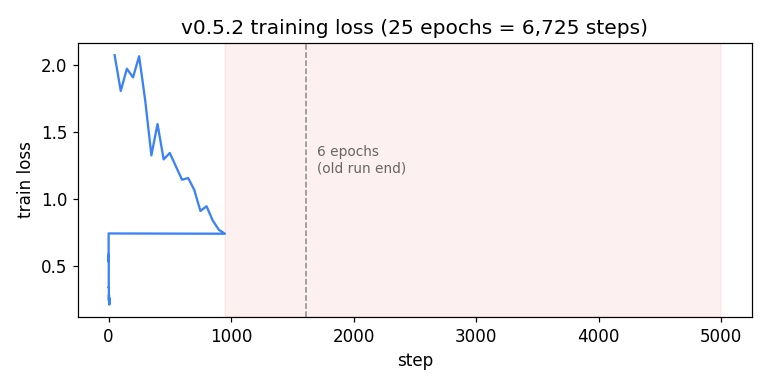

# VLA 데이터 검증 - 일일 이슈 리스트

**작성일**: 2026-06-08  
**상태**: 진행 중

---

## 🟡 **발견 1: 그리퍼 토픽 데이터 오류**

### 뭐가 일어났냐

```
VLA 명령 내림        ✅ action[6] = 0.81~1.0 (잘 기록됨)
        ↓
로봇 실제 움직임     ✅ Timeline에 0→1로 올라감 (동작함)
        ↓
토픽 데이터         ❌ state[12] = 0.001 (고정값)
```

### 현황 분석

| 항목 | 상태 | 값 |
|------|------|-----|
| **명령 (action[6])** | ✅ 정상 | 0.81~1.0 |
| **실제 동작** | ✅ 정상 | Timeline에서 확인 |
| **토픽 데이터 (state[12])** | ⚠️ 오류 | 0.001 고정 |

### 원인
- `/gripper/position` 토픽이 고정값만 기록됨
- 센서 미연결, 토픽 노드 오류, 또는 데이터 수집 오류

### 학습에 미치는 영향
- ⚠️ **학습에 영향 없을 가능성**: VLA 모델이 EEF만 입력받으면 문제 없음
- 🔍 **확인 필요**: 실제 학습 시 state[12] 사용 여부

### 현 상황에서의 대응
- ❓ state[12] 사용 여부 확인 후 판단
- ✅ action[6]은 정상 (학습 가능)
- 📝 새 데이터 수집 시 토픽 확인 필수

---

## 🔴 **발견 4: X축 방향 반대 (주의: 실제 문제)**

### 현황
| 항목 | 값 |
|------|-----|
| **학습 데이터셋** | -X 방향으로 기록 |
| **Mock 추론 테스트** | +X 방향으로 예측 |
| **결론** | ❌ 로봇이 반대 방향으로 움직일 수 있음 |

### 데이터 확인
- [ ] Timeline에서 -X 방향 확인됨 ✅
- [ ] 다른 축(Y, Z)은 방향이 맞는지 확인
- [ ] 전체 에피소드에서 일관되게 -X인지 확인

### 코드 확인
- [ ] ROS 2 bag의 원본 데이터에서 좌표축이 어떻게 정의되어 있는지
- [ ] bag_to_lerobot_eef.py의 좌표 변환 로직
  - [ ] _eef_delta_m_rad() 함수에서 부호 처리
  - [ ] 어디서 축이 반전되는지
- [ ] 로봇 URDF의 좌표계 정의
- [ ] vla_inference_mock_test.py에서 Action 해석 방식

---

## 🟡 **발견 2: Joint State 토픽 데이터 오류**

### 뭐가 일어났냐

Joint State (state[6:11])도 그리퍼처럼 **고정값**으로 기록됨:

| Joint | Min | Max | Std |
|-------|-----|-----|-----|
| J1 | 0.430 | 0.430 | **0.0** |
| J2 | 0.092 | 0.092 | **0.0** |
| J3 | 1.256 | 1.256 | **0.0** |
| J4 | 1.263 | 1.263 | **0.0** |
| J5 | 0.552 | 0.552 | **0.0** |
| J6 | 4.108 | 4.108 | **0.0** |

### 원인
- `/dsr01/joint_states` 토픽이 고정값만 기록됨
- 토픽 수집 오류 또는 데이터 저장 오류

### 학습에 미치는 영향
- ⚠️ **학습에 영향 없을 가능성**: VLA 모델이 EEF만 입력받으면 문제 없음
- 🔍 **확인 필요**: 실제 학습 시 state[6:11] 사용 여부

---

## 🟡 **발견 3: State vs Action의 그리퍼 값 불일치**

### 현황
| 항목 | 범위 | 고유값 |
|------|------|--------|
| **State[12]** | 0.001096 ~ 0.001351 | 2개 |
| **Action[6]** | 0.81 ~ 1.0 | ? |
| **상태** | ❓ 뭐가 일어났는지 불명 |

### 추측
- A) grips 값이 실제로는 0.81~1.0 범위?
- B) action을 저장할 때 다시 정규화?
- C) 다른 처리가 추가됨?

### 확인 필요
- [ ] bag_to_lerobot_eef.py [DEBUG] 출력 → grips 실제값 확인
- [ ] action[6]이 0.81~1.0인 이유 파악
  - [ ] grips가 실제로 0.81~1.0?
  - [ ] action 저장 시 정규화?
  - [ ] 코드 어디서 처리?

---

## 📋 **기타 확인 사항**

### 정규화
- [ ] State[0~5] (TCP): mm/deg → m/rad (코드 확인됨 ✅)
- [ ] State[6~11] (Joint): 이미 rad 형태 (확인됨 ✅)
- [ ] Action[0~5] (EEF delta): m/rad 범위 확인
- [ ] Action[6] (grip_next): 실제 저장 범위 확인

### Joint State
- [ ] 학습 데이터의 Joint State가 실제 로봇 센서값과 일치?
- [ ] 기대값 vs 실제값 오차 분석 필요?

### 카메라 & 동기화
- [ ] 카메라 이미지는 정상? (문서에서 OK)
- [ ] 타임스탬프 동기화 제대로 됐나?
- [ ] 5Hz 샘플링 맞나? (프레임 누락 없나?)

### Dataset 구조
- [ ] State가 정말 13-dim? (EEF 6 + Joint 6 + Gripper 1)
- [ ] Action이 정말 7-dim? (EEF delta 6 + Grip 1)
- [ ] 다른 에피소드도 같은 구조?

---

## 🔥 **우선순위**

### 긴급 (오늘)
1. bag_to_lerobot_eef.py [DEBUG] 출력 → grips 실제값 확인
2. Action[6] = 0.81~1.0인 이유 파악

### 중요 (이번 주)
3. X축 방향 원인 파악 (좌표계 확인)
4. ROS 2 bag 원본 데이터 확인

### 나중 (필요시)
5. 정규화, 타임스탬프, 구조 확인

---

---

## 💥 **현 상황 정리: 토픽 데이터 오류 vs 학습 영향**

### 발견된 토픽 데이터 오류

```
state[t] = [TCP Pose, Joint State, Gripper]
           ✅ 정상   ⚠️ 고정값   ⚠️ 고정값

상세:
- state[0:5]:   TCP Pose (X, Y, Z, Rx, Ry, Rz)    ✅ 정상
- state[6:11]:  Joint State (J1~J6)               ⚠️ 토픽 오류 (고정값)
- state[12]:    Gripper                           ⚠️ 토픽 오류 (0.001)
```

### 실제 학습에 영향이 있는지는 **아직 미확인**

| 항목 | 상태 | 문제 | 학습 영향 |
|------|------|------|---------|
| **TCP Pose** | ✅ 정상 | 없음 | O (사용됨) |
| **Action EEF** | ✅ 정상 | 없음 | O (사용됨) |
| **Joint State** | ⚠️ 오류 | 고정값 | ? (미확인) |
| **Gripper State** | ⚠️ 오류 | 고정값 | ? (미확인) |

### 다음 단계

**중요**: 
- VLA 모델이 **EEF만 입력받으면** 문제 없음
- VLA 모델이 **Joint/Gripper를 입력받으면** 영향 있음
- **어느 쪽인지 확인이 필수**

**현재 상황**:
- 토픽 데이터 오류는 확정
- 학습에 영향을 주는지는 불명
- 새 데이터 수집 필요 여부도 확인 후 판단

---

## 🔍 **우선순위 1: 학습 데이터 입력 흐름 확인 (가장 중요)**

### 핵심 질문
**VLA 모델이 실제로 어떤 state 데이터를 입력으로 사용하나?**
- state[0:5] (EEF)만 사용? → 토픽 오류가 학습에 영향 없음
- state[0:13] 전부 사용? → 토픽 오류가 학습에 영향 있을 수 있음

확인이 필수인 이유:
- 토픽 오류의 실제 영향을 알아야 함
- 새 데이터 수집이 필요한지 판단해야 함

### 1단계: 데이터셋이 어떻게 기록되었는지
```bash
# state가 몇 차원으로 저장되는지 확인
grep -r "observation.state" /home/user/robot_workspace --include="*.py" | grep -E "shape|dim|append"
```
- [ ] state 저장 차원 확인 (6-dim vs 13-dim)
- [ ] 어디서 저장되는지 확인

### 2단계: 데이터 로더가 어떻게 입력받는지
```bash
# 학습 시 state를 어떻게 슬라이싱하는지
grep -r "state\|observation" /home/user/robot_workspace --include="*.py" | grep -E "load|batch|\[:\]"
```
- [ ] 데이터 로더가 전체 state를 받는지, 일부만 받는지
- [ ] state 슬라이싱 여부 확인 (state[:6] vs state[:13])

### 3단계: 모델이 몇 차원을 기대하는지
```bash
# 모델 입력 정의
grep -r "input_size\|state_dim\|observation.*shape" /home/user/robot_workspace --include="*.py"
```
- [ ] 모델 입력 차원 확인
- [ ] 모델 설정에서 state 사용 범위 확인

### 4단계: 실제 학습 코드 찾기
```bash
# 학습 스크립트 위치
find /home/user/robot_workspace -name "*train*.py" -o -name "*learning*.py" -o -name "*main*.py" | head -20

# 파일 구조 파악
find /home/user/robot_workspace/vla_ws -type f -name "*.py" | grep -E "vla|model|train|data" | head -20
```
- [ ] 학습 스크립트 위치 파악
- [ ] 모델 forward() 함수에서 state 사용 범위 확인

### 최종 확인 항목
- [ ] 학습 데이터의 실제 입력 차원 (6-dim? 13-dim?)
- [ ] VLA 모델이 사용하는 state의 범위 명확히
- [ ] 토픽 오류가 실제 학습에 영향을 주는지 판단
- [ ] 토픽 오류의 심각도 재평가 (학습 영향 기반)

---

## 📝 **진행 상황**

| 발견 사항 | 상태 | 진행도 |
|---------|------|--------|
| 그리퍼 토픽 오류 | ✅ 확인됨 | 100% |
| Joint State 토픽 오류 | ✅ 확인됨 | 100% |
| 학습 입력 데이터 확인 | 🔄 **우선순위 1** | 0% |
| X축 방향 문제 | 🔄 진행중 | 30% |

---

**마지막 업데이트**: 2026-06-08  
**현 상황**: 토픽 데이터 오류 확인, 학습 영향 여부 미확인 → 우선 학습 입력 흐름 파악 필수

---
---

# 📅 2026-06-09 — 정규화·추론 입력 파이프라인 정밀 점검

**대상**: `vla_dataset_v0.4.3` (신규 생성) / pi05 학습·추론 파이프라인

## ✅ 결론 한눈에 보기 (발견 이슈 5건)

| # | 이슈 | 구분 | 영향 | 해결 | 적용 위치 |
|---|------|------|------|------|-----------|
| 1 | 입력 **State QUANTILES 정규화 누락** | 추론 | 🔴 치명 (state 토큰 전 차원 어긋남) | ✅ | `serve_pi05.py` (q01/q99 인라인) |
| 2 | **right_wrist 카메라** 빈 슬롯 처리 불일치 | 추론 | 🟠 높음 (학습=더미/추론=base복제) | ✅ | `serve_pi05.py` (빈 슬롯 키 제외) |
| 3 | **그리퍼 state 스케일** 버그 (raw/740²) | 데이터 | 🔴 치명 (정규화 분모≈0 폭발) | ✅ | `fin/vla_dataset_v0.4.3` (×740) |
| 4 | 출력 **Action MIN_MAX 역정규화 누락** | 추론 | 🔴 치명 (출력 [-1,1] 그대로 반환) | ✅ | `serve_pi05.py` (inverse MIN_MAX) |
| 5 | **이미지 리사이즈 불일치** (학습=레터박스 / 추론=정사각 왜곡) | 추론 | 🔴 높음 (딸기 세로로 늘어남→방향 예측 교란) | ✅ | `serve_pi05.py`+클라이언트 (정사각 리사이즈 제거 → 레터박스 일치) |

**상태**: 정규화/역정규화 4건 + 이미지 리사이즈 불일치(#5) 모두 해결. 5건 전부 수정 완료.

> ℹ️ 검증 완료(문제없음): 카메라 슬롯 매핑(base/left_wrist), action=EEF delta 일관성, 프레임/영상 동기화, 이미지 정규화, **delta 적용 프레임(수집·추론 둘 다 DR_BASE 일치 → 좌표프레임 원인 기각)**.
> 🟡 데이터 한계(버그 아님, 재수집 필요): 그리퍼·회전축 저분산, 단일 태스크.

---

## 🟢 발견 #1 — [추론] State 정규화(QUANTILES) 누락 (해결 완료)

### 문제 정의
pi05는 state를 **텍스트 프롬프트에 256-bin 이산화**해서 넣는다. 학습은 **QUANTILES 정규화 → 이산화** 순서인데, **추론 서버는 정규화를 건너뛰고 raw 값을 그대로 이산화**한다. → 같은 자세인데 학습/추론의 state 토큰이 완전히 달라짐.

### 증거 (코드)
- 학습 정식 순서 (`lerobot/.../pi05/processor_pi05.py:139-150`):
  ```
  raw → NormalizerProcessorStep(STATE=QUANTILES, stats.json q01/q99) → [-1,1]
      → Pi05PrepareStateTokenizerProcessorStep (256-bin 이산화 → 프롬프트)
  ```
  주석 L74/L143: *"State should already be normalized to [-1,1] ... NormalizerProcessorStep MUST come before the tokenizer step."*
- 추론 서버 (`serve_pi05.py` predict):
  ```python
  state_np = np.clip(req.state, -1, 1)     # ❌ QUANTILES 정규화 없음
  np.digitize(linspace(-1,1,257)[:-1])     # 이산화 식만 동일
  ```
- 클라이언트(`harvest_dashboard.py:2529`, `grasp_pipeline_pi05.py:297`)는 **raw 물리값**(m/rad/ratio)을 전송.

### 영향 (수치, v0.4.3 stats 기준, 동일 자세)
| dim | raw | 학습 bin (정규화O) | 서버 bin (정규화X) | 차이 |
|-----|-----|------|------|------|
| x_m | 0.20 | 113 | 153 | 40 |
| y_m | 0.40 | 134 | 179 | 45 |
| z_m | 0.87 | 143 | 239 | 96 |
| rx_rad | 1.5699 | 169 | 255(saturate) | 86 |
| ry_rad | 1.5068 | 139 | 255 | 116 |
| rz_rad | -1.5642 | 131 | 0 | 131 |
| gripper | 0.811 | 0 | 231 | 231 |

→ **전 차원이 어긋남.** 회전축은 raw≈1.5라 전부 ±1.0으로 saturate. 모델이 "전혀 다른 상태"로 인식 → 추론 품질 저하 직결.

### 해결방법
**원인**: 추론 경로에서 QUANTILES 정규화 단계가 빠짐. **둘 중 하나로 수정.**

- **(권장) 서버가 정식 프로세서를 쓰도록 리팩터링**: 프롬프트를 수동 조립하지 말고, `obs["observation.state"]=raw` + `task=instruction`을 넣어 `policy.select_action`이 `make_pi05_pre_post_processors` 파이프라인(정규화→이산화)을 그대로 타게 한다. → 학습과 100% 동일 보장.
- **(빠른 우회) 서버 수동 정규화 추가**: 이산화 직전에 stats.json의 state `q01/q99`로 QUANTILES 정규화:
  ```python
  norm = 2*(state - q01)/(q99 - q01) - 1   # 7개 실차원, 나머지 패딩 0
  state_np = np.clip(norm, -1, 1)
  ```
  단, stats.json(`fin/vla_dataset_v0.4.3`)을 서버가 로드해야 함. 모델별 stats 일치 필수.

### 상태
🟢 **해결 (2026-06-09, 서버 적용)** — `serve_pi05.py`에 빠른 우회(수동 QUANTILES) 적용.
- 체크포인트의 `policy_preprocessor_step_2_normalizer_processor.safetensors`에서 `observation.state.q01/q99` 로드 (확인 결과 **N=7**).
- `predict()`에서 `req.state[:7]`에 QUANTILES 정규화(`2*(x-q01)/(q99-q01)-1`) 후 256-bin 이산화 → 학습 프롬프트(7토큰)와 동일 구조.
- 클라이언트는 **raw(m/rad) 전송** (서버가 정규화). 현 클라이언트(dashboard·grasp_pipeline)는 이미 raw 전송이라 호환.

---

## 🟢 발견 #2 — [추론] right_wrist 카메라 처리 불일치 (해결 완료)

### 문제 정의
학습은 카메라 2대(`camera1→base_0_rgb`, `camera2→left_wrist_0_rgb`)만 쓰고, 없는 `right_wrist_0_rgb`는 **더미(-1) + attention mask=0(무시)**로 채운다. 그런데 추론 서버는 빈 슬롯을 **base 이미지 복제 + mask=1(사용)**로 채운다.

### 증거
- 학습 (`modeling_pi05.py` empty-camera 로직): `img = -1` 더미, `mask = 0` → 모델이 무시.
- 추론 (`serve_pi05.py`): `right_img = base_img.clone()` 후 obs에 항상 포함 → 키가 존재하므로 mask=1로 **모델이 attention**.
- 학습 `rename_map`: `{camera1: base_0_rgb, camera2: left_wrist_0_rgb}` (right 없음).

### 영향
학습은 "right_wrist 없음"으로 배웠는데, 추론은 그 슬롯에 base 화면을 넣어 모델이 보게 됨 → 학습에 없던 입력 패턴 → 추론 교란.

### 해결방법
**서버에서 빈 wrist 슬롯을 base로 복제하지 말고 obs에서 키를 제외**한다. 그러면 `modeling_pi05`가 학습과 동일하게 더미(-1)+mask=0으로 채운다:
```python
obs = {base_0_rgb, left_wrist_0_rgb, language...}      # 항상
if req.right_wrist_image:
    obs["observation.images.right_wrist_0_rgb"] = right_img   # 있을 때만
```

### 상태
🟢 **해결 (2026-06-09, 서버 적용)** — `serve_pi05.py`에서 `base_img.clone()` fallback 제거.
- 이미지가 None이면 obs에 키를 넣지 않음 → `modeling_pi05`가 학습과 동일하게 더미(-1)+mask=0으로 처리.
- left_wrist도 동일 처리 (현재는 camera2가 항상 들어옴).

---

## 🟢 발견 #4 — [추론] 출력 Action 역정규화(MIN_MAX) 누락 (해결 완료)

### 문제 정의
학습은 ACTION을 **MIN_MAX 정규화**해서 모델이 **정규화된 action([-1,1])**을 출력하도록 배운다. 추론에서 모델 출력을 **raw(m/rad/ratio)로 역정규화**해야 로봇이 올바로 움직이는데, 서버가 이 단계를 빠뜨리고 **정규화값을 그대로 반환**한다.

### 증거 (코드)
- `modeling_pi05.py:1226-1241` `predict_action_chunk`: `model.sample_actions(...)` → 정규화공간 출력 → 차원 슬라이스만 하고 **역정규화 없이 반환**.
  ```python
  actions = self.predict_action_chunk(batch)[:, : self.config.n_action_steps]
  # 여기까지가 모델 출력 → 정규화([-1,1]) 값
  ```
- 역정규화 `UnnormalizerProcessorStep`는 **별도 postprocessor**(`processor_pi05.py:160-166`, 체크포인트의 `policy_postprocessor.json`)에 정의돼 있으나, **서빙 코드가 postprocessor를 호출하지 않음**.
- 서버 `serve_pi05.py`: `action = policy.select_action(obs)` 결과를 그대로 응답 → **postprocessor 미적용**.
- 클라이언트(`harvest_dashboard.py`)는 `action[:3]`을 raw m로 보고 `×1000`(mm) 변환 → 정규화값에 적용 시 **명령 왜곡**.

### 영향
- 학습 데이터 action 범위: 예) `dx_m ∈ [-0.022, 0.087]`, `grip_next ∈ [0.81, 1.0]`.
- 클라이언트가 받는 값: **[-1, 1] 정규화 값 (잘못된 범위)**.
- 로봇에 그대로 명령 시 **의도치 않은 큰 움직임 / 잘못된 그리퍼 명령**.
- State 정규화(#1)와 함께 추론 동작에 치명적.
- 🔎 참고: 이 버그 때문에 **이전 버전(~v0.4.1) 데모가 어떻게 동작했는지 의아한 수준** — 당시 동작 경위(별도 역정규화 경로 존재 여부 등) 확인 필요.

### 해결방법
모델 출력에 **MIN_MAX 역정규화** 적용: `raw = (norm+1)/2 * (max-min) + min`
- **(빠른 우회)** `action.min`/`action.max`를 동일 `normalizer.safetensors`에서 로드해 위 식 적용 (state q01/q99 로드와 동일 패턴).
- **(권장)** 체크포인트의 **postprocessor(`UnnormalizerProcessorStep`)를 로드해 적용** → MIN_MAX/QUANTILES 모드 무관하게 학습과 일치.

### 그리퍼(action dim6) 주의
ACTION은 feature 단위라 **그리퍼도 동일하게 MIN_MAX**다. 역정규화하면 `grip_next`는 학습 범위 **[0.81, 1.0]의 연속값**으로 복원된다(0/1 아님). 로봇이 binary 그리퍼 명령(0=open/1=close)을 기대하면 **클라이언트에서 임계값 처리** 필요: 예) `grip = 1 if action[6] > 0.9 else 0`.

### 상태
🟢 **해결 (2026-06-09, 서버 적용)** — `serve_pi05.py`에서 모델 출력에 inverse MIN_MAX 인라인 적용: `(norm+1)*(max-min)/2 + min` (`action.min`/`action.max`를 동일 `normalizer.safetensors`에서 로드). 체크포인트 config로 `ACTION=MIN_MAX` 재확인.

---

## 🟢 발견 #5 — [추론] 이미지 리사이즈 방식 불일치 (해결 완료)

### 문제 정의
학습은 이미지를 **resize_with_pad(비율 유지 + 검은 패딩 = 레터박스)**로 224×224 만들고, 추론 서버/클라이언트는 **정사각 강제 리사이즈(왜곡)**로 224×224를 만든다. → 모델이 학습 때와 **다른 모양의 이미지**를 보게 됨.

### 핵심 메커니즘 (`modeling_pi05.py:1178`)
모델 `_preprocess_images`는 **학습·추론 공용**이고, 이미지가 224가 아닐 때만 패딩한다:
```python
if img.shape[1:3] != (224, 224):
    img = resize_with_pad_torch(img, 224, 224)   # 레터박스
img = img * 2.0 - 1.0
```
- **학습**: 데이터로더가 원본 480×640 그대로 줌 → ≠224 → **resize_with_pad 적용** ✅
- **추론**: 서버 `_decode_image`가 미리 224×224로 욱여넣음 → ==224 → **resize_with_pad 스킵** → 왜곡 그대로 ❌

### 변환 과정 (학습 vs 추론)
```
[학습 = resize_with_pad]
  640×480 (4:3)
     ↓ 비율 그대로 1/2.857 축소
  224×168  (딸기 비율 정상)
     ↓ 상/하 28px 검은 패딩
  224×224  ← 위아래 검은띠, 딸기 모양 정상

[추론 = 정사각 resize]
  640×480
     ↓ 가로 ×0.350 / 세로 ×0.467 (배율 다름)
  224×224  ← 검은띠 없음, 딸기 세로로 1.33배 늘어남(왜곡)
```

| | 모델에 도달 크기 | resize_with_pad | 최종 모델 입력 |
|---|------------------|------------------|----------------|
| 학습 | 480×640 (원본) | ✅ 적용 | 레터박스(비율 정상) |
| 추론 | 224×224 (사전 왜곡) | ❌ 스킵 | 세로로 늘어난 왜곡 |

### 영향
모델이 "레터박스 정상비율 딸기"로 학습했는데 추론은 "세로로 늘어난 딸기 + 띠 없음"을 봄 → **물체 위치/형태 인식 어긋남 → 방향 예측 교란**. 실측에서 모델 X/Y 출력이 학습 궤적과 어긋나는 현상의 유력 원인(단, flip이 아닌 stretch라 단독으로 "정확한 반전"을 설명하진 않음).

### 해결방법
추론도 학습과 동일하게 **resize_with_pad(레터박스)**가 적용되게:
- **서버** `_decode_image`: 정사각 `.resize((224,224))` 제거 → `ImageOps.pad`로 레터박스 직접 적용.
- **클라이언트**(grasp_pipeline/mock): 정사각 리사이즈 제거, **원본 640×480 그대로 base64 전송**.

> 참고 이미지: `docs/img_resize_compare/` (A=학습 레터박스, B=추론 왜곡, compare=나란히)

### 상태
🟢 **해결 (2026-06-10, 서버+클라이언트 적용)**

**서버 (`serve_pi05.py`)**
```python
def _decode_image(b64: str, size: tuple = IMAGE_SIZE) -> torch.Tensor:
    # Match training-time resize_with_pad_torch: aspect-ratio-preserving resize
    # followed by symmetric black padding to `size`. Otherwise a 640x480 frame
    # gets squashed to 224x224 at inference while training saw letterboxed input.
    img = Image.open(io.BytesIO(base64.b64decode(b64))).convert("RGB")
    img = ImageOps.pad(img, size, method=Image.BILINEAR, color=(0, 0, 0), centering=(0.5, 0.5))
    return torch.from_numpy(np.array(img, dtype=np.float32)).permute(2, 0, 1) / 255.0
```

**클라이언트 (`grasp_pipeline_pi05.py`, `vla_inference_mock_test.py`)**
- `_encode_image` / `encode_image_to_base64`에서 `.resize((224,224))` 및 `size` 파라미터 제거
- 원본 640×480 JPEG를 base64 전송 → 서버가 `ImageOps.pad`로 레터박스 처리

→ 학습(`resize_with_pad_torch`)과 추론(`ImageOps.pad`) 모두 비율 유지 + 중앙 검은 패딩 → 동일 레터박스 결과.

---

## 🟢 발견 #3 — [데이터] 그리퍼 state 스케일 버그 (해결 완료)

> 6/8자 발견 1·3("그리퍼 state 0.001 고정 / action과 불일치")의 **근본 원인 규명 + 해결**.

### 문제 정의
`observation.state[6]`(그리퍼)이 `raw/740²`(≈0.001)로 잘못 스케일됨. action `grip_next`는 변환 시 `×740` 덕에 우연히 정상 ratio(0.811/1.0)였음.

### 원인
녹화 시점 `/gripper/position`이 `raw/740²`(≈0.001)로 publish됨 (당시 `get_position()`이 740으로 한 번 더 나눔). 변환 스크립트(`bag_to_lerobot_eef.py`)는 정상 — 그 값을 그대로 state로, `×740`해서 action으로 저장. (git이 단일 squash 커밋이라 버그 커밋 추적 불가, 현재 코드는 이미 수정됨.)

### 영향
state 그리퍼 QUANTILES 분모 `q99-q01 ≈ 0.00026` → 추론 시 그리퍼(0~1)가 정규화 후 **수천 배 폭발**.

### 해결방법 (적용 완료)
1. `mid/vla_dataset_v0.4.2` → `v0.4.3` 복사
2. 모든 parquet에서 `observation.state[6] *= 740` (그리퍼만; action·타 차원·비디오 불변)
   - `0.00109569 → 0.810811`(raw 600), `0.00135135 → 1.000000`(raw 740)
3. `fin/vla_dataset_v0.4.3` 생성 + stats.json 재계산 → 분모 `0.00026 → 0.189` (폭발 해소, 추론 스케일 일치)

### 상태
🟢 **해결** — `fin/vla_dataset_v0.4.3`가 권장 학습 데이터. (상세: `dataset_versions.md`)

---

## ℹ️ 검증 완료 — 문제 없음으로 확인된 항목

| 항목 | 결과 |
|------|------|
| 카메라 슬롯 매핑 (base/left_wrist) | ✅ 학습 `rename_map`과 일치. 4개 클라이언트 모두 `camera2→left_wrist_image` 정상 (잘못 바꾼 대시보드 원복함) |
| action = EEF delta 일관성 | ✅ state 전이와 오차 ~1e-16 |
| 프레임 연속성 / timestamp 단조 / index | ✅ |
| 비디오 ↔ parquet 동기화 | ✅ camera1/2 모두 7650 = parquet |
| NaN/Inf | ✅ 없음 |
| 이미지 정규화 (이중정규화 의심) | ✅ `/255`→`*2-1` 고정 직렬변환, VISUAL=IDENTITY라 stats 미사용. 문제없음 |

> **참고 — 카메라 슬롯 교훈**: 물리적 위치(오른쪽/팔)와 무관하게, 모델은 **학습 때 붙인 슬롯 이름**(`left_wrist_0_rgb`)만 안다. 추론도 같은 슬롯으로 보내야 하며, "물리적으로 right니까 right로" 바꾸는 건 학습-추론 불일치를 만든다. (재학습 불필요)

---

## 🟡 알려진 한계 (버그 아님, 재수집으로만 개선)

| 채널 | 현상 | 의미 |
|------|------|------|
| gripper | 값 2개(600→740 단일전환) | "언제 잡을지(완전히 닫을지)" 타이밍만 학습. 여는/놓는·미세폭 제어 불가 |
| rx/ry/rz | ≈90° 거의 고정 (분모 0.0008~0.003) | 회전 학습 신호 거의 없음. 추론 자세가 학습 범위 벗어나면 민감 |
| task_index | 전부 0 | 단일 태스크. 멀티태스크 불가 |

→ 값·스케일은 정상이나 **분산이 작다**. 새 자세/동작/태스크는 학습 불가 → 다양성 있는 재수집 필요.

---

## 🔥 액션 아이템 (2026-06-09 기준)

| # | 항목 | 담당/위치 | 우선순위 | 상태 |
|---|------|-----------|----------|------|
| 1 | 추론 서버 State QUANTILES 정규화 추가 | `serve_pi05.py` (원격) | 🔴 최우선 | ✅ 해결 |
| 2 | 추론 서버 right_wrist 빈 슬롯 처리 (키 제외) | `serve_pi05.py` (원격) | 🟠 높음 | ✅ 해결 |
| 3 | 그리퍼 스케일 수정 + v0.4.3 생성 | 로컬 데이터 | 🟢 완료 | ✅ |
| 4 | 추론 서버 출력 Action MIN_MAX 역정규화 추가 | `serve_pi05.py` (원격) | 🔴 최우선 | ✅ 해결 |
| 5 | **이미지 리사이즈 정사각 제거(레터박스 일치)** | `serve_pi05.py`(원격)+클라이언트 | 🔴 높음 | ✅ 해결 |
| 6 | 추론 실측 검증 (서버 수정 후 동작 확인) + 방향 다중프레임 테스트 | 로봇/서버 | 🔵 다음 | 대기 |
| 7 | (선택) 그리퍼/회전 다양성 재수집 | 데이터 수집 | 🟡 중기 | 보류 |

---

## ⚠️ 잔여 확인사항 (서버 수정은 됐으나 검증 권장)

1. **State 토큰 수(7개) 가정** — "학습 프롬프트=7토큰"은 ① 체크포인트 stats가 7-dim(확실) + ② 로컬 lerobot 코드 읽기(추정)에 근거. **실제 학습은 별도 서버 환경**이라 코드가 다를 수 있음.
   → 서버에서 **정책 자체 프로세서**(`make_pi05_pre_post_processors`)에 샘플을 통과시켜 토큰 수/값이 수동 경로와 일치하는지 1회 대조 권장. (더 안전한 길은 수동 조립 대신 체크포인트 프로세서를 그대로 사용)
2. **정규화 후 클립 차이(경미)** — 서버는 정규화값을 `clip(-1,1)` 후 이산화하나, 학습 토크나이저는 클립하지 않음. **범위 내 값은 동일**, q01 미만(범위 이탈) 값만 bin이 다를 수 있음(서버 0 vs 학습 -1). 영향 작음.
3. **클라이언트 raw 전송 확인** — 서버가 내부 정규화하므로 클라이언트는 raw(m/rad) 전송 필수. dashboard·grasp_pipeline은 이미 raw → OK. 사전 정규화하는 클라이언트가 있으면 제거.

---

**마지막 업데이트**: 2026-06-10
**현 상황**: 5건 전부 해결(#1·#2·#3·#4·#5). 이미지 리사이즈 불일치(#5)는 서버 `_decode_image`에 `ImageOps.pad` 레터박스 적용 + 클라이언트 정사각 리사이즈 제거로 해결. 다음: 실측 추론 검증 (방향 다중프레임 테스트).

### 학습 파이프라인 ↔ 서빙 매핑 (전 단계 점검 완료)
| 학습 단계 | 서빙 처리 | 상태 |
|-----------|-----------|------|
| RenameObservations (camera1→base_0_rgb) | 클라이언트가 해당 키로 전송 | ✅ |
| AddBatchDimension | `.unsqueeze(0)` | ✅ |
| RelativeActions | `use_relative_actions=False` → 스킵 | ✅ |
| Normalize STATE (QUANTILES) | safetensors q01/q99로 인라인 적용 | ✅ |
| Normalize VISUAL (IDENTITY) | 미적용(동일) | ✅ |
| Pi05PrepareStateTokenizer | 256-bin digitize → 7토큰 prompt | ✅ |
| TokenizerProcessor (PaliGemma) | `tokenizer(prompt, ...)` | ✅ |
| DeviceProcessor (→cuda) | `.to(DEVICE)` | ✅ |
| 모델 추론 | `policy.select_action(obs)` | ✅ |
| **Unnormalize ACTION (inverse MIN_MAX)** | `(norm+1)*(max-min)/2+min` 인라인 | ✅ |
| DeviceProcessor (→cpu) | `.cpu().float().numpy()` | ✅ |

> 학습 postprocessor는 `[unnormalizer, device]` 2단계뿐 → 서빙에서 모두 동등 적용. **누락 없음 확인.**

---
---
---

# 📅 2026-06-10 — 추론 파이프라인 완전 검증 + 텔레오퍼레이션 데이터 수집 한계 분석

## ✅ 오늘 확인된 것 요약

| 항목 | 결과 |
|------|------|
| 추론 서버 파이프라인 전 단계 검증 | ✅ 학습과 100% 일치 |
| 모델 출력 이상 현상 원인 규명 | ✅ 데이터 문제로 확정 |
| Streamlit 테스트 앱 기능 개선 | ✅ 다수 추가 (하단 참조) |

---

## 🟢 발견 #6 — [검증] 추론 파이프라인 학습과 완전 일치 확인

### 검증 경위

모델이 학습 데이터대로 움직이지 않는 원인을 파이프라인 불일치 vs 데이터 품질 문제로 나눠 추적.

### 검증 결과

학습(`processor_pi05.py`)과 서버(`serve_pi05.py`) 코드를 항목별로 직접 대조:

| 항목 | 학습 코드 위치 | 서버 코드 위치 | 상태 |
|------|--------------|--------------|------|
| 프롬프트 포맷 | `processor_pi05.py:83` | `serve_pi05.py:253` | ✅ 완전 일치 |
| instruction 전처리 (strip/replace) | `processor_pi05.py:81` | `serve_pi05.py:252` | ✅ 완전 일치 |
| state 정규화 공식 (QUANTILES) | `normalize_processor.py:401` | `serve_pi05.py:244-246` | ✅ 완전 일치 |
| state 이산화 (256-bin digitize) | `processor_pi05.py:77` | `serve_pi05.py:248-249` | ✅ 완전 일치 |
| 이미지 처리 (letterbox) | `modeling_pi05.py:1178` | `serve_pi05.py _decode_image` | ✅ 완전 일치 |
| action 역정규화 (inverse MIN_MAX) | `postprocessor` | `serve_pi05.py` 인라인 | ✅ 완전 일치 |

### 결론

> **서버 추론 파이프라인에 문제 없음. 모델 출력 이상은 순수하게 학습 데이터 품질 문제.**

---

## 🔴 발견 #7 — [데이터] 버튼 누르기 방식 텔레오퍼레이션의 근본적 한계

### 한 줄 요약

> **모델은 "이 화면에서 어디로 움직여야 하나"를 배워야 하는데, 학습 데이터는 "같은 화면인데 정답이 여러 개"인 상황을 반복하므로 모델이 올바른 패턴을 학습할 수 없다.**

---

### 배경 — 현재 텔레오퍼레이션 방식

현재 데이터 수집 방식은 키보드 버튼을 한 번 누를 때마다 로봇이 20mm 이동 후 정지하는 **스텝 방식**이다.

```
버튼 한 번  →  20mm 이동  →  정지
버튼 한 번  →  20mm 이동  →  정지
(딸기가 잡힐 때까지 반복)
```

---

### 문제 1: 학습 데이터의 75%가 "아무것도 하지 마라"

로봇은 버튼을 누른 순간만 움직이고 나머지는 정지해 있다. 5Hz로 데이터를 기록하면 대부분의 프레임이 "로봇이 멈춰 있는" 순간이다.

```
수집된 데이터:
 frame 0  → action =  0 mm  (정지)
 frame 1  → action =  0 mm  (정지)
 frame 2  → action = 20 mm  (버튼 누름)
 frame 3  → action =  0 mm  (정지)
 frame 4  → action =  0 mm  (정지)
 frame 5  → action =  0 mm  (정지)
 frame 6  → action = 20 mm  (버튼 누름)
 ...
```

| 분류 | 프레임 수 | 비율 |
|------|-----------|------|
| 실제 이동 (|delta| > 5mm) | 66 / 259 | **25%** |
| 정지 (near-zero) | 193 / 259 | **75%** |

모델 학습 입장에서 **정답의 75%가 "가만히 있어라"**가 된다.

---

### 문제 2: 같은 화면인데 정답이 다르다 (핵심 문제)

VLA 모델이 배워야 하는 것:
```
f(이미지) → 다음 액션
```

그런데 실제 데이터를 보면 **같은 장면에서 정답이 두 가지**다:

```
[Frame A] 딸기가 오른쪽에 보임  →  action = 0mm   (사람이 버튼 안 누름)
[Frame B] 딸기가 오른쪽에 보임  →  action = 20mm  (사람이 버튼 누름)
[Frame C] 딸기가 오른쪽에 보임  →  action = 0mm   (사람이 버튼 안 누름)
```

이미지는 거의 동일한데 정답이 0도 되고 20mm도 된다. **"언제 버튼을 눌렀느냐"는 이미지에서 절대 알 수 없는 정보**다.

결과: 모델이 이미지를 아무리 잘 봐도 올바른 액션을 예측할 수 없다.

---

### 문제 3: 불연속적인 궤적 — 실제 로봇 동작과 다르다

VLA가 로봇을 제어할 때는 **매 프레임마다 연속적인 delta 명령**을 내린다.
그런데 학습 데이터는 20mm 점프 후 정지를 반복하는 **불연속 패턴**이다.

```
[학습 데이터 궤적]          [VLA 추론 시 원하는 궤적]
  20mm  ─────────┐            연속적으로 흐르는 이동
                 │ 0 (정지)   3mm ─ 4mm ─ 5mm ─ 5mm ─ 4mm
  20mm  ─────────┘
                 │ 0 (정지)   (부드럽고 예측 가능)
  20mm  ─────────┘
```

모델이 불연속 패턴을 학습했으므로 추론 시 부드러운 이동을 만들기 어렵다.

---

### 문제 4: 모델이 학습 데이터대로 나오지 않는 메커니즘 (기술적 설명)

**Step 1. 학습 데이터 분포**

실제 ΔX 범위: `-21.85mm ~ +86.52mm`  
이를 MIN_MAX 정규화하면:
```
물리 0mm  →  정규화 공간 -0.597
물리 20mm →  정규화 공간 -0.228
```

학습 데이터의 75%가 정규화 공간의 `-0.597` 근처에 몰려 있다.

**Step 2. 모델이 수렴하는 곳**

pi05는 flow matching 기반 생성 모델이다. 랜덤 노이즈 z ~ N(0,1)에서 시작해 flow field로 목표 액션으로 끌어당긴다.

데이터가 부족하고 시각-액션 매핑이 불명확하면 → **flow field가 약해짐** → 노이즈가 보정되지 않고 N(0,1)의 평균인 0 근처에서 맴돎

실제 확인된 모델 출력 (정규화 공간): `raw_action ≈ 0.014`

**Step 3. 역정규화 후 큰 값이 나오는 이유**

```
역정규화 공식: x = (norm + 1) / 2 × (max - min) + min

norm = 0.014 대입:
x = (0.014 + 1) / 2 × 108.37 + (-21.85)
x = 0.507 × 108.37 − 21.85
x ≈ +33mm
```

정규화 공간의 0은 물리 공간의 0이 아니다. **범위가 비대칭(-21.85 ~ +86.52)이라 정규화 0의 물리값은 범위 중앙인 +32mm**가 된다.

| 정규화값 | 의미 | 역정규화 (ΔX) |
|----------|------|--------------|
| -0.597 | 물리 0mm (정지) | ≈ 0mm |
| 0.014 | 모델 자연 출력 (노이즈 평균) | ≈ **+33mm** |
| -0.228 | 20mm 이동 | ≈ +20mm |

모델이 "아무 생각 없이" 0을 출력해도 역정규화 후엔 33mm가 된다.  
정확히 0mm를 출력하려면 모델이 정규화 공간에서 **-0.597이라는 편향된 값**을 일부러 학습해야 하는데, 데이터가 충분하지 않으면 그걸 배울 수 없다.

---

### 문제 5: Loss가 낮은데 왜 동작이 이상한가

학습 loss가 0.1xx까지 수렴했는데 추론이 이상한 이유:

```
Loss가 측정하는 것: "학습 데이터 분포에서 평균적으로 틀린 정도"
우리가 원하는 것: "이 화면에서 올바른 방향으로 움직이기"
```

75%가 정지 데이터인 경우, 모델이 "항상 정지"라고 예측하면 loss의 75%는 0이 된다. 모델이 **학습 데이터의 평균을 외운 것**이지 시각 조건에 맞는 액션을 배운 게 아니다.

이를 **평균으로의 수렴(regression to the mean)** 현상이라 한다.

---

### 근본 해결책 vs 단기 대안

| 방법 | 설명 | 효과 | 난이도 |
|------|------|------|--------|
| **연속 텔레오퍼레이션으로 재수집** | SpaceMouse, 게임패드, 키 홀드 방식 | 근본 해결 | 소프트웨어~하드웨어 |
| **move_spline 웨이포인트 방식** | 원하는 좌표 입력 → 로봇이 부드럽게 이동 | 근본 해결 | 소프트웨어 |
| **near-zero 프레임 제외 후 재학습** | 75% 정지 프레임 제거 | 부분 개선 | 즉시 가능 |
| **에피소드 수만 늘리기 (방식 유지)** | 같은 방식으로 데이터만 추가 | 거의 효과 없음 | — |

> **핵심**: 에피소드를 늘리는 것보다 데이터 수집 방식을 바꾸는 게 훨씬 중요하다.
> 버튼 스텝 방식으로는 아무리 많이 수집해도 시각-액션 매핑을 배울 수 없다.

---

### 상태

🔴 **미해결 — 데이터 재수집 필요**

현재 수집된 32 에피소드(`vla_dataset_v0.4.3`)는 파이프라인은 정상이나 데이터 특성상 VLA 학습에 구조적으로 부적합. 새로운 텔레오퍼레이션 방식으로 재수집 필요.

---

## 🛠️ Streamlit 테스트 앱 (`vla_inference_mock_test.py`) 개선사항

| 기능 | 내용 |
|------|------|
| **에피소드 선택기** | `number_input` 추가 (0~31), 에피소드 변경 시 프레임 슬라이더 자동 리셋 |
| **액션 타임라인 차트** | 에피소드 전체 ΔX/ΔY/ΔZ/Grip 시계열 (plotly), 현재 프레임 세로선, 파지 시점 표시 |
| **차트 클릭으로 프레임 이동** | 차트 데이터 포인트 클릭 → 슬라이더 이동 |
| **raw_action 표시** | 역정규화 전 정규화 공간 값 별도 행으로 표시 |
| **프레임 슬라이더 상태 유지** | 추론 버튼 누를 때 슬라이더가 34로 리셋되는 버그 수정 |

---

## 🔥 액션 아이템 (2026-06-10 기준)

| # | 항목 | 우선순위 | 상태 |
|---|------|----------|------|
| 1 | 텔레오퍼레이션 방식 변경 (연속 이동) | 🔴 최우선 | 🔄 검토 중 |
| 2 | 새 방식으로 데이터 재수집 | 🔴 최우선 | ⏳ 대기 |
| 3 | near-zero 프레임 제외 재학습 (단기) | 🟡 선택 | ⏳ 대기 |
| 4 | 실측 추론 검증 (로봇 연결 후) | 🟠 중요 | ⏳ 대기 |

---

**마지막 업데이트**: 2026-06-10  
**현 상황**: 추론 파이프라인 완전 검증 완료 (학습-추론 100% 일치). 모델 성능 한계는 버튼 스텝 방식 텔레오퍼레이션의 구조적 문제로 확정. 데이터 재수집 방식 검토 필요.

---
---

# 📅 2026-06-10 (후속) — 텔레오퍼레이션 move_spline 전환 + v0.5.0 재학습 착수

## 🔄 발견 #7 후속 조치 — 데이터 재수집 방식 확정 및 재학습 진행

### 변경 내용

텔레오퍼레이션 방식을 **버튼 스텝 → TCP 좌표 기반 move_spline 웨이포인트 방식**으로 전환했다.

```
[기존: 버튼 스텝 방식 (v0.4.3)]
  버튼 한 번 → 20mm 점프 → 정지 → 정지 → 정지 → 버튼 → 20mm 점프 ...
  → action이 0과 20mm 사이를 오가는 뾰족뾰족한(스파이크) 계단 패턴

[신규: move_spline 방식 (v0.5.0)]
  목표 TCP 좌표 입력 → 로봇이 스플라인 보간으로 부드럽게 연속 이동
  → 매 프레임 작고 연속적인 delta가 기록되는 완만한 패턴
```

### v0.4.3이 학습에 끼친 영향 정리 (전환 근거)

v0.4.3 action 데이터의 두 가지 핵심 성질이 학습을 구조적으로 망가뜨렸다:

| 성질 | 데이터 현상 | 학습에 끼친 영향 |
|------|------------|------------------|
| **0이 많음** (정지 75%) | 259프레임 중 193프레임이 near-zero action | 정답의 75%가 "가만히 있어라" → 모델이 시각 조건과 무관하게 **데이터 평균을 외움** (loss는 낮은데 동작 무의미). 같은 화면에 정답 0/20mm가 혼재해 시각-액션 매핑 자체가 학습 불가 |
| **뾰족뾰족함** (0↔20mm 스파이크) | 연속 궤적이 아닌 불연속 계단 점프 | VLA 추론은 매 프레임 연속 delta를 내야 하는데 학습 분포에 "중간 크기의 부드러운 delta"가 존재하지 않음 → 부드러운 궤적 생성 불가. 범위 비대칭(-21.85~+86.52mm)과 결합해 모델의 무난한 출력(정규화 0)이 역정규화 후 +33mm로 튐 |

→ 두 성질 모두 "에피소드 추가"로는 해결 불가, **수집 방식 자체를 바꿔야** 해소됨.

### v0.5.0 기대 효과

| 항목 | v0.4.3 (버튼 스텝) | v0.5.0 (move_spline) 기대 |
|------|--------------------|---------------------------|
| action 분포 | 75% 정지 + 25% 20mm 스파이크 | 연속적인 소~중 크기 delta (정지 구간 최소화) |
| 궤적 형태 | 불연속 계단 | 완만한 연속 곡선 |
| 시각-액션 매핑 | 같은 화면에 정답 0/20mm 혼재 | 화면 상태와 delta가 1:1 대응 |
| 모델 출력 경향 | 평균으로 수렴 (시각 무시) | 시각 조건 기반 방향 예측 기대 |

### 목적

**move_spline로 수집한 완만한 action 패턴으로 학습하면 추론이 제대로 되는지 검증**하는 것이 이번 v0.5.0 사이클의 핵심 목표. 파이프라인은 이미 학습-추론 100% 일치가 검증됐으므로(발견 #6), 이번 결과로 "데이터 품질이 원인"이라는 가설(발견 #7)이 최종 확인된다.

### 상태

🔄 **진행 중 (2026-06-10)** — move_spline 방식으로 데이터 재수집 완료(`vla_dataset_v0.5.0`), 현재 재학습 진행 중.

### 다음 단계

- [ ] v0.5.0 학습 완료 후 loss 곡선 확인
- [ ] mock 테스트(`vla_inference_mock_test.py`)로 학습 궤적 대비 추론 출력 비교
- [ ] action 타임라인 차트로 "완만한 연속 delta" 출력 여부 확인
- [ ] 실로봇 추론 검증 (방향/그리퍼 타이밍)

---
---

# 📊 부록 — 데이터 변환 전 과정 (로봇 수집 → 학습 → 추론)

> 같은 데이터가 단계마다 **단위·범위·형식**이 어떻게 바뀌는지 한눈에. (v0.4.3 기준)

## 큰 그림 (3단계)

```
┌─────────────────────────────────────────────────────────────────────────┐
│  [A] 수집 → 학습 데이터화                                                 │
│                                                                           │
│  로봇 센서 ──rosbag(raw)──▶ bag_to_lerobot_eef.py ──▶ mid ──▶ fin         │
│  (mm/deg,                  (단위변환 mm→m,deg→rad)   (LeRobot)  (+stats)   │
│   ratio, uint8)            (+EEF delta 계산)                              │
└─────────────────────────────────────────────────────────────────────────┘
                                   │
                                   ▼
┌─────────────────────────────────────────────────────────────────────────┐
│  [B] 학습 (pi05)                                                          │
│                                                                           │
│  fin ──DataLoader──▶ Preprocessor ──▶ 모델(정규화 공간 학습)              │
│   raw값            정규화/이산화/토큰화        손실=정규화된 action 기준   │
└─────────────────────────────────────────────────────────────────────────┘
                                   │
                                   ▼
┌─────────────────────────────────────────────────────────────────────────┐
│  [C] 추론 (서빙)                                                          │
│                                                                           │
│  로봇 ──client(raw)──▶ server(정규화→모델→역정규화) ──▶ client ──▶ 로봇   │
│  (mm/deg)            (학습과 동일 파이프라인 재현)      (raw)     (delta)  │
└─────────────────────────────────────────────────────────────────────────┘
```

핵심 원리: **모델은 항상 "정규화 공간"에서만 동작.** 입력은 들어가기 전 정규화, 출력은 나온 뒤 역정규화. 학습과 추론이 **같은 stats(q01/q99, min/max)**를 써야 일치.

---

## 모달리티별 변환 추적 (값 1개가 끝까지 어떻게 변하나)

### ① TCP 위치 (x) — state 입력
| 단계 | 값/단위 | 처리 |
|------|---------|------|
| 로봇 센서 | `350 mm` | Doosan native |
| mid/fin | `0.350 m` | `÷1000` (mm→m) |
| 학습 정규화 | `[-1,1]` 토큰 | QUANTILES: `[q01,q99]→[-1,1]` → 256bin |
| 추론 client | `0.350 m` | 로봇 mm `÷1000` (raw 전송) |
| 추론 server | `[-1,1]` 토큰 | 동일 QUANTILES (q01/q99 from safetensors) |

### ② TCP 회전 (rx) — state 입력
| 단계 | 값/단위 |
|------|---------|
| 로봇 | `90 deg` |
| mid/fin | `1.5708 rad` (`deg→rad`) |
| 학습/추론 정규화 | QUANTILES → `[-1,1]` (분산 작아 거의 saturate) |

### ③ 그리퍼 — state 입력 & action 출력
| 단계 | state gripper | action grip_next |
|------|---------------|------------------|
| 로봇 | `get_position()` = ratio 0~1 | — |
| mid v0.4.2 | `0.001` ❌ (raw/740² 버그) | `0.811/1.0` ✅ |
| **mid/fin v0.4.3** | **`0.811/1.0`** ✅ (`×740` 수정) | `0.811/1.0` |
| 학습 정규화 | QUANTILES→[-1,1] | MIN_MAX→[-1,1] |
| 추론 server 출력 | — | 역MIN_MAX → `0.811~1.0` (ratio) |
| 추론 client→로봇 | — | `×740` → `0~740 raw` (`harvest_dashboard.py:2576`) |

### ④ Action delta (dx) — 출력
| 단계 | 값/단위 |
|------|---------|
| mid/fin | `dx_m` (Δm, 범위 ±0.087) |
| 학습 | MIN_MAX: `[min,max]→[-1,1]` (target) |
| 추론 모델 출력 | `[-1,1]` (정규화 공간) |
| 추론 server 역정규화 | `(norm+1)/2*(max-min)+min` → `dx_m` (raw) |
| 추론 client→로봇 | `×1000`→mm, **clamp ±200mm**, delta 이동 |

### ⑤ 카메라 — 이미지 입력
| 단계 | 값/형식 |
|------|---------|
| 로봇 | uint8 RGB `480×640` |
| mid/fin | MP4 (uint8) |
| 학습 로딩 | 영상 decode → `÷255` → `[0,1]` |
| 학습 모델 | resize `224`, `×2−1` → `[-1,1]` (SigLIP) |
| 키 매핑 | `camera1→base_0_rgb`, `camera2→left_wrist_0_rgb` |
| right_wrist | 학습=더미(-1)+mask0 / 추론=키 제외(동일 처리) |
| 추론 client | RGB 원본 그대로 base64 (리사이즈 없음) |
| 추론 server | `ImageOps.pad`(레터박스 224×224)→`÷255`→`[0,1]`→모델 `×2−1` |

---

## 단위 요약 (어디서 무슨 단위인가)

| 모달리티 | 로봇/센서 | 학습 데이터(parquet) | 모델 내부 | 추론 출력→로봇 |
|----------|-----------|----------------------|-----------|----------------|
| 위치 | mm | m | 정규화 [-1,1] | (state 전용) |
| 회전 | deg | rad | 정규화 [-1,1] | (state 전용) |
| 그리퍼 | ratio 0~1 | ratio 0.811~1.0 | 정규화 [-1,1] | ratio→`×740`→0~740 |
| action 위치 | — | Δm | 정규화 [-1,1] | Δm→`×1000`→mm |
| action 회전 | — | Δrad | 정규화 [-1,1] | Δrad→`×57.3`→deg |
| 이미지 | uint8 0~255 | MP4 uint8 | [-1,1] | — |

---

## 핵심 규칙 3가지 (직관)

1. **단위 변환과 정규화는 다른 것.** mm→m, deg→rad는 "단위 변환"(데이터화 단계). [-1,1]로 펴는 건 "정규화"(학습/추론 런타임). 정규화는 데이터에 저장하지 않고 stats로 매번 적용.
2. **모델은 정규화 공간에서만 산다.** 입력=정규화 후 투입, 출력=역정규화 후 사용. 학습·추론이 같은 stats를 써야 함 (state=QUANTILES q01/q99, action=MIN_MAX min/max).
3. **클라이언트는 raw(m/rad/ratio)만 다룬다.** 정규화는 서버가, 단위 변환(×1000, ×57.3, ×740)은 클라이언트가. 클라이언트에서 사전 정규화하면 이중 정규화 → 금지.

---
---

# 2026-06-11 — nearest-neighbor 동기화로 인한 action 파형 왜곡 (v0.5.0)

## 발견 #8 — [데이터] 같은 동작인데 에피소드마다 action 파형이 다른 원인: 샘플링 아티팩트

### 한 줄 요약

> **로봇 동작은 50개 에피소드 모두 동일한데, tcp_pose 토픽과 5fps 그리드를 nearest-neighbor로 동기화하는 과정에서 타이밍 지터가 delta 0 / 스파이크로 변환되어 에피소드마다 다른 파형이 만들어진다.**

### 배경 — 출발점이 된 의문

> "같은 모션인데도 파형이 다르고, 뾰족뾰족한 파형이 왜 계속 생기나?"
>
> 기존 버튼 스텝 방식(v0.4.3)의 뾰족한 파형은 수집 방식 탓(발견 #7)이라 쳐도, **이번 v0.5.0은 move_spline으로 부드럽게 연속 이동시켰는데도** 여전히 스파이크가 보였다.

조사 결과, **v0.4.3의 스파이크와 v0.5.0의 스파이크는 원인이 다르다**:

| | v0.4.3 (버튼 스텝) | v0.5.0 (move_spline) |
|---|---|---|
| 로봇의 실제 움직임 | 실제로 점프+정지 (불연속) | 부드러운 연속 이동 (정상) |
| 스파이크의 정체 | 실제 동작이 그랬음 | **기록/변환 과정의 아티팩트** |
| 원인 단계 | 데이터 **수집** 방식 (발견 #7) | 데이터 **변환** 동기화 (이번 발견) |
| 해법 | 수집 방식 전환 (완료) | 변환 스크립트 보간 교체 |

즉 move_spline 전환으로 발견 #7(실제 불연속 동작)은 해결됐지만, 그 아래 숨어 있던 변환 단계 문제가 드러난 것. 로봇은 매끈하게 움직였고, 파형이 뾰족한 건 순전히 변환 산출물에서다.

### 발견 경위 — v0.5.0 실측

`fin/vla_dataset_v0.5.0` (move_spline 방식, 50 에피소드)의 액션 타임라인 차트를 비교하니 같은 동작인데 파형이 에피소드마다 크게 달랐다. 실측 분석 결과:

| 항목 | 측정값 | 의미 |
|------|--------|------|
| 시작 위치 | 전부 `[-0.225, 0.339, 0.901]` 부근 | 동일 동작 |
| 총 변위 | 전부 ~227mm | 동일 동작 |
| 평균 step | 2.8~4.2mm | 비슷 |
| **최대 step** | **6.0mm ~ 30.7mm (5배 차이)** | 파형만 다름 |
| zero-step 수 | 4개(ep29) ~ 21개(ep15) | 에피소드별 편차 큼 |

깨끗한 에피소드(ep29)는 가속 → 순항(스텝당 ~6mm = 30mm/s) → 감속의 매끈한 사다리꼴 속도 프로파일. 지저분한 에피소드(ep15, ep49)는 정상 프로파일 위에 `0, 0, 스파이크` 패턴이 반복.

```
ep29 (깨끗): 2.1 2.4 2.7 3.0 ... 5.8 6.0 6.0 6.0 5.9 ...   (max 6.0mm)
ep49 (왜곡): ... 2.0  0.0 10.5 ...                          (0 다음 2배 스파이크)
ep15 (심함): ... 0.0  0.0 29.5  0.0 ...                     (0들 다음 5배 스파이크)
```

### 근본 원인 — nearest-neighbor 동기화

`bag_to_lerobot_eef.py:229-235`의 `_nearest()`가 범인이다. 5fps 그리드를 만들고 각 그리드 시점에 가장 가까운 `/dsr01/tcp_pose` 샘플을 그대로 집어온다(보간 없음). tcp_pose 토픽의 발행 주기가 흔들리거나 잠깐 끊기면 같은 샘플이 연속 그리드에 두 번 선택되고 → delta 0 → 다음 프레임 스파이크가 된다.

에피소드마다 그리드와 토픽 발행 타이밍의 **위상이 다르니, 같은 동작인데도 어떤 에피소드는 매끈하고(ep29) 어떤 건 톱니가 된다(ep15)**. 에피소드 시작부의 0 구간 길이가 제각각인 것도 녹화 시작~로봇 출발 사이 대기 시간 차이일 뿐이다.

### 메커니즘 상세 — 두 개의 시계가 따로 돈다

데이터 변환 시 시간축이 두 개 있다:

- **tcp_pose 토픽**: 로봇 드라이버가 자기 주기로 발행 (예: ~20Hz, 50ms 간격)
- **5fps 그리드**: 변환 스크립트가 만든 고정 시간축 (정확히 200ms 간격)

`bag_to_lerobot_eef.py:229`의 `_nearest()`가 각 그리드 시점마다 "가장 가까운 tcp_pose 샘플"을 보간 없이 그대로 집는다. 두 시계는 동기화되어 있지 않아, 어떤 샘플이 집히는지는 상대적 타이밍에 달려 있다.

**정상 케이스** — 토픽이 꾸준히 들어오면 그리드마다 다른 샘플이 잡힌다:

```
tcp_pose:   p0  p1  p2  p3  p4  p5  p6  p7  p8  p9 ...   (50ms 간격)
                ^               ^               ^
그리드(200ms):  G0              G1              G2
선택:           p1              p5              p9

state:  [p1, p5, p9]  →  delta: p5-p1 ≈ 6mm,  p9-p5 ≈ 6mm   (매끈)
```

**문제 케이스** — 드라이버 부하, 네트워크 지연, rosbag 기록 누락 등으로 토픽이 250ms쯤 끊기면:

```
tcp_pose:   p0  p1  p2        (끊김)        p3  p4  p5 ...
                ^               ^               ^
그리드:         G0              G1              G2
선택:           p2              p2  <- 같은 샘플!  p4
                                (G1에서 가장 가까운 게 여전히 p2)

state:  [p2, p2, p4]
delta:  p2-p2 =  0mm  <- 가짜 정지
        p4-p2 = 12mm  <- 2프레임치 변위가 한 번에 (스파이크)
```

핵심: **로봇은 그동안 계속 움직이고 있었다.** 멈춘 건 로봇이 아니라 포즈 "보고"다. 차분(`action[t] = state[t+1] - state[t]`, 실측 오차 0 확인)을 내면 보고가 멈춘 구간은 0으로, 재개된 순간은 밀린 변위가 합산된 스파이크로 나타난다.

### 스파이크 크기가 "밀린 프레임 수 × 순항 속도"인 이유 (telescoping)

delta의 합은 중간항이 전부 소거된다:

```
delta 합 = (s1-s0) + (s2-s1) + (s3-s2) = s3 - s0
```

delta를 어떻게 쪼개든 **총합은 항상 실제 총 변위로 보존**된다. 0이 된 프레임의 변위는 사라지지 않고 다음 delta로 이월된다:

- ep49: `0, 0, 8.5` → 8.5 ≈ 2.8mm × 3프레임 (2프레임 밀림)
- ep15: `0, 0, 29.5` → 29.5 ≈ 6mm × 5프레임 (순항 중 4프레임 밀림)
- 50개 에피소드 총 변위가 전부 ~227mm로 같은 것도 이 보존 법칙 때문 (파형이 망가져도 적분값은 동일)

### 덜 극단적인 버전 — 위상 지터

완전히 끊기지 않아도, 잡힌 샘플이 그리드 시점보다 살짝 앞/뒤인 게 번갈아 일어나면 delta가 작게/크게 출렁인다 (둘의 합은 2×순항속도 유지):

```
ep02: ... 3.3  1.8  5.7 ...  4.9  2.5  7.8 ...   (잔물결, 쌍의 합 ≈ 12mm)
```

에피소드마다 녹화 시작 시점과 토픽 발행 위상이 무작위로 어긋나므로, **같은 동작인데 에피소드마다 다른 파형**이 된다. 에피소드 시작부의 0 구간 길이가 제각각인 것도 녹화 시작~로봇 출발 사이 대기 시간 차이일 뿐이다.

### 왜 차분이 이걸 증폭하나

포즈 자체는 1샘플 타이밍 오차가 있어도 위치 오차로 몇 mm 수준이다. 그런데 차분을 내면 그 오차가 인접한 두 delta에 ±로 갈라져 들어간다. 순항 delta 6mm에 타이밍 오차 ±3mm면 신호 대비 50% 노이즈 — "미분은 노이즈를 증폭한다"는 일반 원리 그대로다.

### 학습에 미치는 영향

ACTION 정규화가 MIN_MAX라서 스파이크가 직접 피해를 준다:

- 정상 순항 step이 6mm인데 min/max가 30mm 스파이크로 잡히면, [-1,1] 정규화 후 실제 유효 신호가 ±0.2 정도의 좁은 구간에 압축됨
- 모델이 배워야 할 신호의 해상도가 스파이크 때문에 ~1/5로 깎임
- 가짜 정지(delta 0) 프레임은 발견 #7의 "같은 화면인데 정답이 다름" 문제를 소규모로 재생산 (v0.4.3만큼 심하진 않음)

### 해결방법

| 방법 | 설명 | 효과 |
|------|------|------|
| **(권장) 보간으로 교체** | `_nearest` 대신 그리드 시점 기준 위치는 선형 보간, 회전은 slerp | 타이밍 지터 흡수, 스파이크 제거. 근본 해결 |
| 후처리 스무딩 | delta 0 프레임과 직후 스파이크를 균등 분배 | 부분 개선 (이미 변환된 데이터에 적용 가능) |
| tcp_pose 발행 주기 상향 | raw 단계에서 nearest 오차 자체를 축소 | 보조 수단 (끊김에는 무력) |

### 상태

**해결됨 (2026-06-11)** — `bag_to_lerobot_eef.py` 동기화를 보간 방식으로 교체 완료. 상세 내용·검증 결과는 아래 "발견 #8 해결" 섹션 참조.

### 다음 단계

- [x] raw bag에서 tcp_pose 실제 발행 간격 분포 확인 (중앙값 ~58ms, 에피소드당 200ms 초과 끊김 0~5회, 최대 1142ms)
- [x] `bag_to_lerobot_eef.py` 동기화를 보간으로 교체 (위치/회전 모두 선형, 회전은 unwrap 처리 — slerp 불필요 판단, 해결 섹션 참조)
- [x] 교체 후 에피소드별 max step / zero-step 재측정 (50개 전부 순항 속도 ~6-8mm로 수렴 — 해결 섹션 표 참조)
- [ ] 50 에피소드 전체 재변환 + fin 데이터셋 재생성 (`teleop_convert_eef.sh` 실행 대기)
- [ ] 진행 중인 v0.5.0 학습 결과와 보간 적용 버전 비교 여부 결정

---

**마지막 업데이트**: 2026-06-11
**현 상황**: v0.5.0 액션 파형 편차의 원인을 nearest-neighbor 동기화 아티팩트로 확정. 로봇 동작·총 변위는 전 에피소드 동일하며 데이터 변환 단계만의 문제. → 같은 날 보간 방식으로 교체 완료 (아래 "발견 #8 해결" 섹션).

---

## 발견 #9 — [데이터] v0.5.0 학습 모델이 접근은 하는데 멈추지 못하는 원인

### 한 줄 요약

> **접근 궤적은 비슷하게 나오지만(발견 #7 가설 입증) 종료가 안 되는 이유: "정지" 액션이 정규화 공간의 극단(±1)에 위치해 출력하기 가장 어렵고, 정지 시범이 데이터의 ~6%뿐이며, 종료를 표시하는 그리퍼 이벤트가 v0.5.0에 아예 없다.**

### 배경 — 관찰된 현상

v0.5.0(move_spline)으로 학습한 모델이 딸기에 접근하는 동작은 학습 궤적과 비슷하게 출력함. 그러나 목표 지점에 도달해도 멈추지 않고 계속 이동. 데이터에서 "멈춤"을 배울 수 있는 신호가 있는지 확인.

### 원인 1 — "정지"가 정규화 공간의 극단에 있다 (질의 문제, 가장 결정적)

이 동작은 단방향이다 (dx 항상 ≤0, dy ≥0, dz ≤0). 그래서 MIN_MAX 범위의 한쪽 끝이 곧 물리적 0(정지)이 된다 (stats.json 실측):

| 차원 | 데이터 범위 | 정지(0mm)의 정규화 위치 |
|------|------------|------------------------|
| dx | [-20.6, +0.1] mm | **+0.992** |
| dy | [-0.0, +14.3] mm | **-0.994** |
| dz | [-17.7, 0.0] mm | **+0.996** |

멈추려면 모델이 **정규화 극단값(±1 부근)을 세 차원 동시에, 오차 없이** 출력해야 한다. flow matching 출력은 데이터 질량이 몰린 중앙부(순항 구간)로 끌리므로 극단을 정확히 치기 어렵다.

```
예: dx를 +0.992 대신 +0.9로 출력 (오차 0.09)
역정규화: (0.9+1)/2 × 20.7 + (-20.6) = -0.9mm
→ 멈추지 않고 매 프레임 같은 방향으로 계속 기어감
```

정지 프레임을 늘려도 "극단값을 정확히 맞혀야 멈춘다"는 구조는 그대로다. 양방향 동작이 섞이면 0이 범위 중앙쯤에 와서 작은 오차가 +/-로 상쇄(떨림)되지만, 단방향 데이터에선 오차가 전부 전진 방향으로 누적된다.

### 원인 2 — 정지 시범이 데이터의 ~6%뿐 (양의 문제)

에피소드 꼬리의 정지 프레임(step < 0.5mm)은 평균 **3.9프레임**(약 0.8초). 에피소드당 ~64프레임 중 4프레임 수준.

```
꼬리 zero-step 분포 (50 에피소드): 1개×1, 2개×11, 3개×12, 4개×12, 5개×6, ...
ep29 마지막 10프레임(mm): 2.2 1.9 1.4 1.1 0.9 0.3 0.0 0.0 0.0 0.0
```

감속 막바지 프레임은 이미지상 정지 프레임과 거의 구별이 안 되는데 정답은 미세하게 다르다(0.3mm vs 0mm) — 신호가 약하고 모호하다.

### 원인 3 — 종료 이벤트(그리퍼)가 아예 없다 (설계의 문제)

```
action[6] (grip): 전 에피소드 · 전 프레임 600 고정
state[6]  (grip): 전부 0.8108 고정
```

**v0.5.0 수집 때 그리퍼를 한 번도 닫지 않았다.** v0.4.3에는 600→740 전환(파지)이 "태스크 끝"의 자연스러운 마커였는데 v0.5.0에서 사라짐. 실전 VLA 배포에서 "정책이 정확히 0을 출력해 멈춘다"에 의존하는 경우는 드물고 보통 그리퍼 닫힘 같은 이벤트를 종료 조건으로 쓰는데, 그 이벤트를 배울 재료가 데이터에 없다.

### 부수 발견 — 그리퍼 관련 2건

| # | 문제 | 영향 |
|---|------|------|
| 1 | **MIN_MAX 분모 0**: grip min=max=600 | 역정규화가 어떤 모델 출력이든 600으로 고정 → **이 모델은 그리퍼를 영원히 못 닫음**. 학습 시 NaN 발생 여부도 확인 필요 |
| 2 | **grip 스케일 회귀**: v0.4.3=ratio(0.81~1.0) → v0.5.0=raw(600) | `bag_to_lerobot_eef.py`의 `×740`이 ratio 아닌 값에 적용된 것으로 추정. normalization_guide.md의 "재변환 시 grip 스케일 변동" 경고가 실제 발생한 사례. mock 테스트 앱의 파지 시점 검출(`x[6] > 0.85`)도 grip=600이라 전 프레임이 걸려 무의미해짐 |

### 해결방법 (우선순위순)

| 순위 | 방법 | 효과 |
|------|------|------|
| 1 | **수집 시 파지(그리퍼 닫기)까지 포함** | 종료 이벤트 복원. 그리퍼 전환이 멈춤의 명시적 마커가 되고, 실전에서 "그리퍼 닫힘 = 루프 종료" 조건으로 사용 가능. 이게 해결되면 원인 1의 중요도도 하락 (delta를 정확히 0으로 만드는 게 유일한 멈춤 수단이 아니게 됨) |
| 2 | **에피소드 끝 정지 구간 1~2초(5~10프레임) 녹화** | 멈춤 시범 비율 상향 (현 6% → 15~20%) |
| 3 | **grip 스케일 통일(ratio) + min==max 분모 0 처리 확인** | 부수 발견 2건 해소. 재변환 시 필수 |

### 상태

**미해결 (2026-06-11)** — 원인 규명 완료. 파지 포함 + 정지 구간 연장 방식으로 재수집 필요.

### 다음 단계

- [ ] 텔레오퍼레이션 시나리오에 파지(그리퍼 닫기) + 종료 후 정지 구간(1~2초) 추가
- [ ] 재수집 후 grip 600→740 전환이 action에 기록되는지 + 스케일(ratio)인지 확인
- [ ] 학습 로그에서 grip 차원 분모 0으로 인한 NaN/이상 loss 여부 확인
- [ ] 추론 루프 종료 조건을 "grip > 임계값"으로 구현 (delta 0 의존 제거)

---

## 참고 — 정규화 모드 정리: MIN_MAX vs QUANTILES (수식 포함)

> **작성 배경 (2026-06-11)**: 추론 서버의 ACTION 역정규화가 아직 MIN_MAX인 채로 남아 있을 가능성 확인 → QUANTILES로 교체 후 재시험 예정. 교체 작업 전에 두 모드의 수식·성질·이 데이터에서의 실제 차이를 정리해둔다.

### 수식

x = 원본값, 통계는 모두 우리 데이터셋의 `stats.json`에서 가져온다.

**MIN_MAX** (필요 통계: `min`, `max`)

```
정규화:    norm = 2 × (x − min) / (max − min) − 1
역정규화:  x    = (norm + 1) / 2 × (max − min) + min
```

- 데이터의 최솟값 → -1, 최댓값 → +1. 모든 데이터가 정확히 [-1, 1] 안에 들어감.
- **단 한 개의 outlier가 min/max를 결정** → 극단값에 매우 민감.

**QUANTILES** (필요 통계: `q01`, `q99` — 하위/상위 1% 분위수)

```
정규화:    norm = 2 × (x − q01) / (q99 − q01) − 1
역정규화:  x    = (norm + 1) / 2 × (q99 − q01) + q01
```

- 데이터의 1%~99% 구간 → [-1, 1]. **양 끝 1%의 outlier는 [-1, 1] 바깥으로 나감** (범위 보장 없음, 대신 극단값에 둔감).
- 수식 구조는 MIN_MAX와 동일하고 기준 통계만 min/max → q01/q99로 바뀐 것.

**참고: 기타 모드**

| 모드 | 수식 | 비고 |
|------|------|------|
| IDENTITY | norm = x | 변환 없음 (우리는 VISUAL에 사용) |
| MEAN_STD | norm = (x − mean) / (std + ε) | 평균 0 / 분산 1. 범위 비보장 |
| QUANTILE10 | QUANTILES와 동일하되 q10/q90 사용 | 더 공격적인 outlier 무시 |

### 두 모드의 성질 비교 (v0.5.0 action dx 실측)

| 통계 | 값 | 의미 |
|------|-----|------|
| min | -20.6 mm | 발견 #8의 **스파이크가 결정한 값** |
| q01 | **-11.0 mm** | 스파이크 제외한 실질 하한 (min의 약 절반) |
| q99 | +0.01 mm | 단방향 동작이라 0 부근 |
| max | +0.08 mm | |

→ **MIN_MAX는 스파이크(아티팩트)가 정규화 범위를 2배로 부풀린다.** 정상 순항 6mm가 MIN_MAX에선 범위의 29%, QUANTILES에선 54%를 차지 — QUANTILES로 바꾸면 발견 #8로 깎인 신호 해상도가 약 2배 회복된다. 스파이크 자체는 [-1, 1] 바깥(약 -1.7)으로 밀려나 학습에서 outlier로 취급된다.

### 모드 불일치 시 실제 오차 (왜 학습-추론이 같은 모드여야 하나)

모델이 QUANTILES로 학습됐는데 서버가 inverse MIN_MAX로 역정규화하면 (dx 실측 통계 기준):

```
물리값 dx = -6mm (정상 순항)
QUANTILES 정규화:  norm = 2×(−0.006−(−0.01102))/(0.00001−(−0.01102)) − 1 = −0.090
                   → 모델은 이 값을 출력하도록 학습됨

서버가 inverse MIN_MAX 적용 (잘못):
x = (−0.090+1)/2 × 0.02066 + (−0.02058) = −0.0112 → −11.2mm

정답 −6mm vs 출력 −11.2mm  →  약 1.9배 과대 이동
```

같은 norm 값이라도 기준 통계가 다르면 복원값이 달라진다. **방향은 맞는데 보폭이 일정 배율로 틀어지는** 전형적 증상 (이번 "접근은 비슷한데 과/소이동" 관찰과 부합 가능성 — 서버 수정 후 재확인).

### QUANTILES 전환이 해결하는 것 / 못 하는 것

| 항목 | 해결 여부 |
|------|----------|
| 발견 #8 스파이크로 인한 해상도 손실 | 해결 (q01/q99는 스파이크에 둔감, 해상도 ~2배 회복) |
| 학습-추론 모드 불일치 (학습이 QUANTILES인 경우) | 해결 (서버 inverse 식 교체) |
| 발견 #9 원인 1 — 정지가 극단에 위치 | **못 함** (정지(0)의 정규화 위치: MIN_MAX +0.992 → QUANTILES +0.998, 여전히 극단) |
| 발견 #9 원인 3 — grip 종료 이벤트 부재 | **못 함** (grip은 q99−q01 = 0, min−max와 똑같이 분모 0. 어느 모드든 재수집 필요) |

### 서버 교체 체크리스트

- [ ] 학습 환경의 실제 ACTION 모드 확인 (config 또는 체크포인트 postprocessor에서 — v0.4.x 시점엔 MIN_MAX였음, §2026-06-09 발견 #4 참조)
- [ ] `serve_pi05.py` 역정규화 식 교체: `(norm+1)/2×(max−min)+min` → `(norm+1)/2×(q99−q01)+q01`
- [ ] q01/q99 로드 출처를 학습 체크포인트의 normalizer stats로 통일 (stats.json과 불일치 가능성 차단)
- [ ] STATE는 이미 QUANTILES — 변경 불필요. 클라이언트는 raw 송수신이라 무변경
- [ ] mock 테스트로 GT 대비 출력 배율 재확인 (위 1.9배 왜곡이 사라지는지)

---

## 발견 #8 해결 — 동기화를 nearest-neighbor에서 선형 보간으로 교체

### 한 줄 요약

> **"그리드 시점에서 가장 가까운 보고값을 줍는" 방식을 "앞뒤 보고값 사이를 직선으로 이어 그 시점의 값을 계산하는" 방식으로 바꿨다. 50개 에피소드 전수 측정에서 스파이크가 사라지고 max step이 순항 속도(~6-8mm) 수준으로 수렴했다. 작업 중 두 번째 아티팩트(rosbag 버스트 타임스탬프)를 추가 발견해 함께 수정했다.**

### 바꾼 것 — 비유로 먼저

데이터 변환은 "로봇 위치를 200ms마다 한 번씩 받아 적는" 일이다.

- **기존 (nearest)**: 받아 적는 시각마다 "가장 가까운 시점의 보고"를 그대로 적는다. 보고가 잠깐 끊기면 같은 보고를 두 번 적게 되고(가짜 정지), 보고가 재개되면 그동안 움직인 거리가 한 번에 적힌다(스파이크).
- **변경 (보간)**: 받아 적는 시각의 직전 보고와 직후 보고를 찾아, 둘 사이를 직선으로 이어 "그 시각엔 여기쯤 있었겠다"를 계산해서 적는다. 보고가 끊겨도 끊김 양끝 사이를 일정한 속도로 메우므로 가짜 정지도 스파이크도 생기지 않는다.

발견 #8에서 확인했듯 로봇은 실제로 매끈하게 움직였으므로, 직선으로 메우는 것이 실제에 가장 가까운 복원이다. 위상 지터(잡힌 샘플이 그리드보다 살짝 앞/뒤인 문제)도 원천 제거된다 — 보간값은 정확히 그리드 시각의 값이기 때문이다.

### 코드 변경 내용

파일: `src/bag_to_lerobot_eef.py` (`teleop_convert_eef.sh`가 호출하는 변환 스크립트)

| 함수 | 역할 |
|------|------|
| `_interp_columns()` (신규) | (N, D) 시계열을 그리드 시점에서 채널별 선형 보간 |
| `_interp_eef_poses()` (신규) | EEF pose 보간. 회전 3채널은 unwrap → 보간 → 다시 ±180°로 wrap |
| `_respace_duplicate_ts()` (신규) | 버스트로 뭉친 타임스탬프를 발행 주기 간격으로 되감아 재배치 (아래 부수 발견 #8-b) |
| `_report_gaps()` (신규) | 그리드 간격(200ms) 초과 끊김을 변환 로그에 `[GAP]`으로 출력 — 품질 추적용 |
| `synchronize()` (수정) | tcp_pose / joint_states / gripper의 nearest 선택을 보간으로 교체 |

신호별 처리:

| 신호 | 처리 | 이유 |
|------|------|------|
| tcp_pose 위치 (x, y, z) | 선형 보간 | 연속 물리량 — 직선 근사가 타당 |
| tcp_pose 회전 (rx, ry, rz) | unwrap 후 선형 보간 | 179°와 -179°는 실제로 2° 차이인데 그냥 보간하면 0° 근처를 지나는 엉뚱한 값이 나옴. 미리 펼쳐서(-179° → 181°) 보간 후 다시 감는다. 텔레옵 속도에선 quaternion slerp까지 필요 없음 |
| joint_states, gripper | 선형 보간 | 연속값. joint는 ±180° 경계가 없어 unwrap 불필요 |
| 카메라 이미지 | nearest 유지 | 이미지는 중간값 계산이 불가능. 기존 중복 프레임 재사용 로직 그대로 |

부가 사항:

- 그리드가 토픽 범위 밖(에피소드 시작 전/종료 후)이면 양끝 보고값으로 클램프 (`np.interp` 기본 동작) — 시작부의 진짜 정지 구간은 그대로 유지된다
- int64 나노초 타임스탬프를 float으로 바로 바꾸면 정밀도가 깎이므로, 에피소드 시작 시각을 뺀 상대 시간으로 보간

### 부수 발견 #8-b — 두 번째 아티팩트: rosbag 버스트 타임스탬프

보간을 적용했는데도 ep15에 `0, 0, 13.1` 패턴이 하나 남았다. raw bag을 직접 들여다보니 **끊김의 정체가 "메시지 누락"이 아니라 "타임스탬프 뭉개짐"**인 경우가 있었다:

```
3.745s  x=-244.68    <- 여기까지 정상 (58ms 간격)
4.236s  x=-244.68    <- 490ms 공백 후
4.236s  x=-246.26    <- 7개가 전부 같은 시각에!
4.236s  x=-247.76       (실제 간격: 17~76 마이크로초)
4.236s  x=-249.39
  ...
4.286s  x=-252.67    <- 이후 다시 정상
```

로봇 드라이버는 58ms마다 꼬박꼬박 발행했고 포즈 값도 전부 다르다(로봇은 계속 움직였다). 그런데 rosbag 기록기가 잠깐 막혔다 풀리면서 **버퍼에 쌓인 메시지 7개에 "기록된 시각" 도장을 한꺼번에 찍은 것.** 위치 정보는 살아 있는데 시간 정보만 죽었다. 발견 #8의 "메시지가 안 온 경우"와 증상은 같지만 원인이 다르다.

시각이 전부 같으면 보간도 손을 쓸 수 없다 — 직선을 이으려면 가로축(시간)이 퍼져 있어야 한다. 그래서 타임스탬프를 복원한다: 인접 간격이 발행 주기의 1/4보다 촘촘하면 버스트로 판정하고, 묶음의 마지막 시각부터 발행 주기 간격으로 거꾸로 펼쳐 직전 공백 안에 재배치한다 (`_respace_duplicate_ts`).

```
복원 전:  3.745s ......(490ms 공백)...... [7개 전부 4.236s]
복원 후:  3.745s ... 3.888s  3.946s  4.004s  4.062s  4.120s  4.178s  4.236s
                     (58ms 간격으로 되감아 배치 → 보간 가능해짐)
```

이 복원이 들어가자 ep15의 잔여 패턴 `0, 0, 13.1`이 `4.9, 6.3, 6.3`으로 풀렸다 (max step 13.1 → 7.4mm).

### 검증 결과 — 50 에피소드 전수 측정

raw bag을 두 방식으로 각각 동기화해 tcp 위치 delta(mm)를 비교:

| 지표 | nearest (기존) | 보간 (변경) |
|------|---------------|------------|
| max step 평균 | 15.7mm | **7.2mm** |
| max step 최악 | 30.7mm | **8.1mm** |
| max step > 8mm인 에피소드 | **48 / 50개** | 1 / 50개 |
| zero-step 평균 | 11.1개 | 7.1개 (잔여분은 시작부 실제 정지) |
| 에피소드 총 변위 | ~227mm | 동일 (telescoping 보존 그대로) |

최악이었던 두 에피소드의 스파이크 주변 파형 (프레임당 변위, mm):

```
ep15  nearest:  9.0  3.0  8.9  0.0  0.0  29.5  0.0  0.0  2.8  5.7  8.2
      보간   :  7.4  4.2  7.0  4.9  6.3   6.3  6.3  6.3  3.6  6.5  6.5

ep49  nearest:  5.8  5.7  0.0  0.0  0.0  30.7  0.0  0.0  4.6  4.2  4.0
      보간   :  5.8  5.7  4.0  5.4  5.4   5.4  5.4  5.5  4.3  4.3  3.9
```

가짜 정지(0)와 5배 스파이크(29.5, 30.7)가 사라지고 순항 속도(~6mm)로 평탄해졌다. 깨끗했던 에피소드(ep29: max 6.0 → 6.8mm)는 거의 변화 없음 — **고장난 곳만 고쳐졌다.** ep15 한 에피소드는 전체 파이프라인(비디오 인코딩 + parquet 저장)까지 통과시켜 산출물에서 동일 수치를 재확인했다.

학습 영향과 연결하면: ACTION min/max가 30mm 스파이크 대신 ~8mm 실제 분포로 잡히므로, 발견 #8에서 지적한 신호 해상도 압축(~1/5)이 풀린다. 이는 정규화 모드 교체(MIN_MAX → QUANTILES, 위 참고 섹션)와 독립적인 개선 — 둘 다 적용하는 것이 맞다.

### 보간이 해결 못 하는 것 (한계)

- **직선 가정**: 공백 동안 로봇이 가감속했다면 그 디테일은 복원 불가. 다만 이번 데이터의 공백은 순항 구간이라 직선 근사 오차가 작고, 어떤 경우든 0+스파이크보다는 실제에 가깝다.
- **에피소드 시작부의 0 구간**: 녹화 시작~로봇 출발 사이의 실제 정지라 보간 대상이 아니다 (zero-step이 평균 7.1개 남는 이유). 발견 #9의 정지 학습 문제와는 별개 사안.
- **긴 공백 모니터링**: 변환 로그에 `[GAP] tcp_pose: ... 끊김 N회, 최대 NNNms` 라인이 추가됐다. 재변환 시 로그를 한 번 훑어 비정상적으로 긴 공백(1초 이상)이 있는 에피소드를 확인할 것.

### 상태

**해결됨 (2026-06-11)** — 변환 스크립트 수정·검증 완료. 전체 재변환은 아직 실행 전.

### 다음 단계

- [ ] `teleop_convert_eef.sh`로 50 에피소드 전체 재변환 (mid 데이터셋 갱신, `[GAP]` 로그 확인)
- [ ] `prepare_fin_dataset.py`로 fin 데이터셋 + quantile stats 재생성
- [ ] 재생성된 stats.json에서 action min/max/q01/q99 재확인 (스파이크 소멸이 반영됐는지)
- [ ] 보간 버전으로 재학습 → v0.5.0(nearest) 학습 결과와 비교

---

## 참고 — 선형 보간이란 무엇인가 (쉬운 설명)

> **작성 배경 (2026-06-11)**: 발견 #8 해결에 쓴 "선형 보간"의 개념 정리. 나중에 읽어도 이해되도록 비유부터.

### 한 문장 정의

**두 개의 알려진 점 사이를 직선으로 잇고, 그 직선 위에서 중간 시점의 값을 읽어내는 것.** "선형(linear)"은 두 점을 곡선이 아니라 직선으로 잇는다는 뜻이다.

### 일상 비유 — 띄엄띄엄 오는 위치 보고

친구가 자동차로 이동 중인데 위치를 띄엄띄엄만 알려준다:

- 3시 정각: "서울이야" (0km 지점)
- 4시 정각: "수원이야" (40km 지점)

3시 30분에 친구는 어디였을까? 정확히는 모르지만, 일정한 속도로 달렸다고 가정하면 "중간쯤인 20km 지점"이 가장 합리적인 추측이다. 3시 15분이라면 4분의 1 지점인 10km. 이게 선형 보간의 전부다.

### 수식

시각 `t1`에 값 `v1`, 시각 `t2`에 값 `v2`를 알 때, 그 사이 시각 `t`의 값:

```
v(t) = v1 + (v2 - v1) × (t - t1) / (t2 - t1)
              ↑           ↑
          전체 변화량   시간이 얼마나 지났는지의 비율 (0~1)
```

`(t - t1) / (t2 - t1)`이 "두 점 사이에서 어디쯤이냐"는 비율. t = t1이면 0이라 v1 그대로, t = t2면 1이라 v2 그대로, 정중앙이면 0.5라 두 값의 평균. 코드의 `np.interp`가 이 계산을 그리드 전체에 대해 한 번에 해준다.

### 자주 하는 오해 — "그냥 평균으로 채우는 것 아닌가?"

비슷하지만 다르다. 보간은 **시간 위치에 따라 비중이 달라지는 가중 평균**이고, 그냥 평균(반반 섞기)은 그중 정중앙 딱 한 경우다.

```
3.0s에 x = 100,  4.0s에 x = 200 일 때:

3.1s → 110   (앞 보고에 가까우니 100에 90%, 200에 10% 비중)
3.5s → 150   (정중앙이니 딱 평균)
3.9s → 190   (뒤 보고에 가까우니 200에 90% 비중)
```

이 차이가 중요한 이유: 공백 구간에 그리드 점이 여러 개 떨어질 때, 전부 평균(150)으로 채우면 고치려던 문제가 그대로 재발한다.

```
평균 채우기:  100, 150, 150, 150, 200  →  delta: 50, 0, 0, 50   (또 가짜 정지 + 점프!)
보간 채우기:  100, 125, 150, 175, 200  →  delta: 25, 25, 25, 25 (등속으로 매끈)
```

평균으로 채우면 채운 구간끼리 값이 같아 delta가 또 0이 되고 양 끝에서 점프가 생긴다. 보간은 시간이 흐른 만큼 값도 비례해서 옮겨주므로 delta가 일정하게 나온다. 한 줄로: **평균은 "두 값을 반반 섞기", 보간은 "시간이 지나간 비율만큼 섞기"** — 그래서 로봇이 그 사이를 일정 속도로 지나간 것처럼 복원된다.

### 우리 데이터에 적용한 모습 — nearest와 나란히

tcp_pose가 끊긴 상황에서 그리드 시점 G1(4.0s)의 값을 정해야 할 때:

```
시간:      3.745s ──────────(공백)────────── 4.236s
보고:      x = -244.68                       x = -252.67
                          ↑
그리드 G1:              4.0s 시점의 x는?

nearest:  "가장 가까운 보고를 그대로 쓰자" → -244.68 (3.745s 값을 복사)
          → 로봇이 멈춘 것처럼 기록됨 (가짜 정지 → 다음 프레임 스파이크)

보간:     비율 = (4.0 − 3.745) / (4.236 − 3.745) = 0.52  (52% 지점)
          x = −244.68 + (−252.67 − (−244.68)) × 0.52 = −248.8
          → 그 사이를 일정 속도로 지나갔다고 보고 중간값을 계산
```

nearest는 "있는 값 중 하나를 고르는" 방식이라 보고가 없는 구간에서 같은 값을 반복할 수밖에 없다. 보간은 "없는 시점의 값을 계산해 내는" 방식이라 공백을 자연스럽게 메운다.

### 왜 이 가정이 우리 경우에 타당한가

선형 보간은 "두 점 사이에서 값이 일정한 속도로 변했다"는 가정 위에 서 있다. 가정이 틀리면(그 사이에 급가속했다면) 보간값도 틀린다. 우리 로봇은:

- move_spline으로 부드럽게 연속 이동하고 (발견 #8에서 확인)
- 공백이 생긴 구간이 대부분 일정 속도의 순항 구간이었다

즉 "직선" 가정이 실제 움직임과 거의 일치해 보간 오차가 매우 작다. 검증에서 복원된 delta들이 정확히 순항 속도(~6mm/프레임)로 나온 것이 그 증거.

### 회전에만 있는 함정 — unwrap이 필요한 이유

각도는 -180°와 +180°가 같은 곳이라 직선 잇기가 깨지는 지점이 있다:

```
실제: 179° → -179°  (시계 방향으로 2°만 살짝 돈 것)
보간을 그냥 하면: 179와 -179의 중간 = 0°  (반대편으로 반 바퀴 도는 셈!)
```

그래서 보간 전에 각도를 "펼친다"(unwrap): -179°를 181°로 바꿔 연속 수열로 만들면 179°와 181°의 중간 = 180°로 올바르게 계산된다. 끝나면 다시 ±180° 범위로 감아 저장. `_interp_eef_poses()`에서 회전 3채널만 이 처리를 거치는 이유다.

### 요약 비교

| | nearest (기존) | 선형 보간 (변경) |
|---|---|---|
| 동작 | 가장 가까운 보고를 **복사** | 앞뒤 보고 사이 직선에서 **계산** |
| 보고가 끊기면 | 같은 값 반복 → 0 + 스파이크 | 일정 속도로 메움 → 매끈한 delta |
| 평균과의 관계 | — | 시간 비율로 섞는 가중 평균 (반반 평균은 정중앙 한 점뿐) |
| 가정 | 없음 (대신 타이밍 오차를 그대로 노출) | 두 점 사이 등속 이동 (우리 데이터에 부합) |

---

## 발견 #10 — [학습] 25에폭에도 위상 추적 실패: 병목은 스텝 수가 아니라 LoRA 적응 범위 (+ PEFT 모듈명 버그)

**날짜**: 2026-06-12 · **대상**: pi05_sft_v.0.5.2 (보간 데이터 + "Approach to the strawberry stem.", 25에폭 = 6,725스텝)

### 증상

6에폭(1,614스텝) 언더핏 진단 후 25에폭으로 재학습했으나, 추론이 여전히 GT를 크게 못 따라감.

### 진단 (서버 API 직접 호출, Episode 8)

**1) 로스는 수렴·정체** — 2.08 → 0.22로 떨어진 뒤 약 5,000스텝부터 0.22~0.24에서 평탄. 같은 구성으로 에폭 추가는 무의미.



**2) 프레임별 GT 추적 테스트** — 에피소드를 따라 7개 프레임에서 각각 새 추론, 첫 액션 vs GT:

| frame | GT dx (mm) | 모델 dx (mm) | 비고 |
|---|---|---|---|
| 0 | -0.02 (정지) | -0.65 | 출발 전인데 움직임 |
| 30 | -5.14 (GT 피크) | -2.72 | 피크에서 절반 |
| 40 | -3.89 | -3.97 | 교차점에서만 일치 |
| 60 | 0.00 (목표 도착) | -5.08 (모델 최대) | 멈춰야 할 곳에서 최대 출력 |

GT는 종 모양(가속→감속→정지)인데 모델 출력은 에피소드 진행에 따라 단조 증가. 프레임 간 상관 ≈ 0. **발견 #9의 "멈추지 못함" 패턴이 보간 데이터 + 25에폭에서도 재현** — 데이터·스텝 문제가 아니라 모델이 관측→속도 매핑 자체를 못 배우는 것.

**3) 반복 분산** — 같은 입력 5회 반복 시 표준편차 ±0.4mm (출력 대비 ~40%). 수렴 후에도 분산 큼.

**4) 인프라는 정상** — 서빙 stats(모델 번들 normalizer)·이미지 전처리(letterbox 224) 모두 학습과 일치 확인.

### 해석

전역 이동 방향(-X,+Y,-Z)은 학습됐으나 "현재 관측에서 남은 거리를 읽어 속도를 조절"하는 매핑 실패. 관측 처리(PaliGemma LM·vision)가 완전 동결된 상태에서 expert(Q/V만 LoRA)가 받아 쓸 수 있는 특징에 한계 → **LoRA 적응 범위가 병목**.

### 부수 발견 — PEFT 기본 target_modules의 모듈명 버그

기본값 정규식(`modeling_pi0.py:1316`)의 `state_proj`, `action_time_mlp_in/out`은 **pi05에 존재하지 않는 이름** (pi0용). pi05는 state를 프롬프트 토큰으로 넣어 state_proj가 없고, time MLP 실제 이름은 `time_mlp_in/out`. 즉 **지금까지 모든 학습에서 time MLP(denoising 시간 임베딩)는 한 번도 적응되지 않았음** (조용한 매칭 실패). 반복 분산 문제와 관련 가능성.

### pi05 실제 모듈 인벤토리 (pi05_base 체크포인트에서 추출)

| 위치 | 모듈명 |
|---|---|
| gemma_expert (18층) | q_proj, k_proj, v_proj, o_proj, gate_proj, up_proj, down_proj |
| language_model (18층) | 위와 동일 7종 |
| vision_tower (27층) | q_proj, k_proj, v_proj, out_proj, fc1, fc2 |
| top-level | action_in_proj, action_out_proj, time_mlp_in, time_mlp_out |

### 조치

1. **train.sh — `peft.target_modules` 나열식 지원**: yaml에 모듈명 리스트를 주면 suffix 정규식(`.*\.(a|b|c)`)으로 자동 변환해 전달. 문자열(정규식)은 그대로 전달. (`--peft.target_modules` 포워딩 추가)
2. **train.sh — `decay_steps` 자동 폴백**: yaml 미지정 시 총 스텝 수로 자동 설정 (기존엔 LeRobot 기본 30,000이 그대로 쓰임).
3. **평가 도구**: `vla_inference_mock_test.py`에 "모델 진단" 섹션 추가 — 프레임별 GT 추적(상관/진폭비/자동판정) + 반복 분산(변동계수) 버튼.

### 다음 실험 구성 (권장)

```yaml
lr: 2.5e-5            # 1e-5 → 2.5e-5
peft:
  r: 32               # 16 → 32
  target_modules: [q_proj, k_proj, v_proj, o_proj, gate_proj, up_proj, down_proj,
                   action_in_proj, action_out_proj, time_mlp_in, time_mlp_out]
```

| 그룹 | 이유 |
|---|---|
| q/k/v/o_proj | attention 전체 적응. LM에도 적용되어 state 토큰·이미지 통합 단계가 우리 도메인에 적응 (위상 추적 실패에 정조준). vision tower의 q/k/v에도 적용됨 (인지 병목 보조) |
| gate/up/down_proj | 트랜스포머 파라미터의 2/3인 MLP. "거리→속도" 비선형 매핑 저장소. 로스 정체(표현력 한계) 해소에 가장 직접적 |
| action_in/out_proj | flow matching 입출구. 좁은 delta 분포(±5mm)로의 적응, 출력 진폭에 직결 |
| time_mlp_in/out | 모듈명 버그로 지금까지 미학습이던 시간 임베딩 복구. 반복 분산 개선 기대 |
| 제외: lm_head | 액션 생성 경로에 없음 |
| 제외: out_proj/fc1/fc2 (vision 전용) | 과적합·변인 통제. 이번에도 상관이 안 오르면 다음 카드 (또는 freeze_vision_encoder 해제) |

판정 기준: 앱 "프레임별 GT 추적 진단"의 상관계수가 0 근처 → +0.5 이상으로 오르는지, 반복 분산 변동계수가 0.3 아래로 내려오는지.

---

## 발견 #11 — [학습] 모델이 이미지를 무시하고 state만 사용: 지름길 학습 (발견 #9/#10의 근본 원인)

**날짜**: 2026-06-12 · **대상**: pi05_sft_v.0.5.2 (25에폭) · **방법**: 서버 API 직접 호출 약 100회 (다중 에피소드/프레임 + 입력 ablation)

### 결정적 증거 — 입력 교차 ablation (Episode 8)

초반(frame 10)과 종반(frame 57)의 이미지·state를 교차 조합:

| 입력 조합 | 모델 dx 출력 |
|---|---|
| 이미지(초반) + state(초반) | -0.73 mm |
| 이미지(종반) + state(초반) | -0.67 mm — 이미지 교체 영향 없음 |
| 이미지(초반) + state(종반) | -5.34 mm — state 교체로 7배 변화 |
| 이미지(종반) + state(종반) | -5.46 mm |

**출력이 state에만 의존, 이미지 교체 영향 ~2%.**

### 보조 증거

- **6 에피소드 × 6 프레임 (36회)**: 모델 출력 크기의 상관 — GT와 -0.13 (무관), 시작점 이동거리와 **+0.97**, 목표까지 남은거리와 **-0.97**. 모델 = "출발점에서 멀수록 세게 미는" 단조함수.
- **lag 분석 (ep8, 5프레임 간격)**: 모델 출력은 GT를 +30프레임 지연시킨 형태와 corr +0.96 — 단조함수가 종 모양(가속→감속)을 절반만 흉내 낼 때의 패턴.
- **극단 테스트**: 정상 범위 이미지 교체(타 프레임/타 에피소드)에는 무반응, 검은 화면에만 출력 변화 (-5.55 → -3.22 mm) — 이미지가 차단된 것은 아니나 정책이 장면 차이를 사용하지 않음. state를 목표 너머로 외삽해도 출력 미감소(포화) — 순수 state 함수 확정.

### 해석 — 왜 이렇게 배웠나

딸기(목표) 위치는 에피소드마다 다르고 이미지에만 존재. state(절대 위치)만으로는 "내 목표까지 남은 거리"를 알 수 없음. 그 상태로 위치→속도의 데이터 평균을 학습하면: 감속 위치는 에피소드마다 흩어져 평균에서 소거되고, 먼 위치 샘플은 긴 에피소드의 순항 속도가 지배 → **"멀수록 빠르게" 단조 매핑**이 됨. 관측 결과와 정확히 일치. state 토큰이 저차원·고상관이라 모델이 어려운 이미지 입력을 버리는 전형적 지름길 학습(shortcut learning). **발견 #9(미정지)·#10(위상 추적 실패)의 근본 원인.**

### 함의 및 대책

1. **vision/LM LoRA 추가(v.0.5.3 실험)는 필요조건이지 충분조건이 아님** — state 지름길로 로스가 이미 낮아지면 vision을 개발할 gradient 압력이 없음. 판정은 학습량이 아니라 **ablation으로**.
2. **state dropout 학습**: pi05는 state가 프롬프트 토큰이므로, 학습 시 일정 확률(30~50%)로 State 섹션을 제거/마스킹 → 이미지 없이는 손해 보게 만들어 vision 사용을 강제. lerobot 포크 프롬프트 생성부 수정으로 구현 가능.
3. **waypoint 액션 재정의 (구조적 차단)**: 액션을 "목표까지의 변위"로 바꾸면 정답 생성에 이미지가 필수가 되어 지름길 자체가 불가능. 감속 프로파일 학습도 제거됨(movespline이 담당). 변환 스크립트 수정만으로 시험 가능.
4. **다음 수집 시 딸기 위치 다양화**: vision→목표 매핑의 학습 신호 강화.

### 도구

`vla_inference_mock_test.py` "모델 진단"에 **입력 의존성 진단(이미지/state 교차)** 버튼 추가 — A/B 프레임 교차 4조합 추론 후 이미지 영향 vs state 영향 비율을 자동 판정 (비율 0.2 미만 = 지름길 의심). 새 모델이 나올 때마다 이 버튼으로 먼저 판정할 것.

### 추가 검증 — 지름길은 학습 극초반부터 형성 (5에폭 체크포인트 비교)

25에폭 모델과 비교하기 위해 5에폭(1,345스텝) 체크포인트를 merge해 서빙 후 동일 프로브 실행:

| 지표 | 5에폭 (1,345스텝) | 25에폭 (6,725스텝) |
|---|---|---|
| ablation 이미지/state 영향 비율 | **0.05** (0.28mm vs 5.95mm) | ~0.1 |
| 프레임별 GT 추적 corr (dx) | -0.06 | ≈ 0 |
| 출력 패턴 | 동일한 단조 증가 (frame 0: -1.8 → frame 60: -4.95mm) | 동일 |

**결론**: 지름길(이미지 무시)은 학습 후반에 굳어진 것이 아니라 **5에폭 이전, 학습 극초반부터 완성**되어 있었다. state 토큰이 너무 쉬운 신호라 gradient가 처음부터 그쪽으로만 흐른 것. 학습량 연장이나 용량 추가만으로는 깨지지 않을 가능성이 높다는 추가 증거.

체크포인트 교체 절차 (재사용 가능):

```bash
# 1) merge (CPU, vla-train 컨테이너에서 — GPU 영향 없음)
docker exec vla-train python3 /workspace/src/merge_pi05.py \
    --adapter /models/ours/<job>/checkpoints/<step>/pretrained_model \
    --base /models/public/pi05_base \
    --output /models/ours/<job>/merged_<step>
# (normalizer stats는 merge_pi05.py가 adapter에서 자동 복사)
# 2) serve/docker-18003/.env 의 MODEL_HOST_PATH/STATS_HOST_PATH 교체 후
docker compose up -d --force-recreate   # 로드 약 80초
```

### 추가 검증 2 — 베이스 모델(zero-shot) 비교: 파인튜닝이 이미지 반응성을 오히려 억제

pi05_base를 그대로 서빙해 동일 프로브 실행. 단 베이스 디렉토리에는 데이터셋 stats가 없어 서버가 **정규화 없음(identity) 모드**로 동작 — mm 절대값 비교 불가, 스케일 무관 지표로만 비교.

| 지표 | 베이스 (zero-shot) | 파인튜닝 (25에폭) |
|---|---|---|
| 이동 방향(부호) 일치 | 0% — dz가 GT와 반대(상승) | 100% — 전 프레임 (-X, +Y, -Z) |
| GT 방향과 코사인 유사도 | +0.06 (무관) | 높음 (방향 항상 일치) |
| 출력 스케일 | 정규화 raw 그대로 (제어 불가) | 데이터 분포에 맞는 mm 스케일 |
| 프레임별 GT 추적 상관 | ≈ 0 | ≈ 0 (둘 다 실패) |
| 이미지 영향 비율 (ablation) | **0.34** | **0.05~0.1** |

**해석**:

1. 파인튜닝은 작업 방향·액션 스케일 학습에 성공 — 베이스 대비 명확한 개선. zero-shot 베이스는 제어에 사용 불가.
2. 위상 추적(가속/감속)은 둘 다 실패 — 파인튜닝이 이 능력을 추가하지 못함.
3. **이미지 영향 비율이 베이스 0.34 → 파인튜닝 0.05로 하락** — 사전학습에 있던 이미지 반응성을 파인튜닝이 적극적으로 억제한 것. 지름길 학습 가설의 직접적 보강 증거. (베이스는 state 입력이 identity 모드로 왜곡된 채였으므로 비율 절대값은 참고 수준)
4. 향후 실험의 추가 관전 지표: 새 모델의 이미지 영향 비율이 베이스 수준(0.3+)으로 회복되는가.

### 개념 정리 — "이미지가 학습 안 됐다"의 정확한 의미와 발견 #8과의 관계

혼동하기 쉬운 세 층위를 구분한다:

**층위 1 — 라벨 모호 (발견 #8, 데이터 문제, 해결됨)**: 버튼식 조작 + nearest 동기화로 같은 관측에 "정지(0)"와 "점프(스파이크)" 라벨이 섞여 있던 문제. 선형 보간(v0.5.1)으로 해소. 이게 해결됐는데도 위상 추적이 안 되어 다음 층위가 드러남.

**층위 2 — 이미지 처리 가중치가 학습 대상이 아니었음 (구성 문제)**: 기존 타겟은 expert q/v + action 투영뿐 — vision tower(27층)·language_model(18층)은 LoRA 0개, 완전 동결. 단 **동결 = 이미지 미입력이 아님**: 동결된 vision도 추론 시 특징을 계산해 시퀀스에 넣어주고, 학습된 expert는 attention으로 그 이미지 토큰을 읽을 수 있었다. (검은 화면에 출력이 반응하는 이유 — 경로는 살아 있음.)

**층위 3 — 학습된 부분이 이미지를 사용하지 않기로 수렴 (지름길, 학습 동역학 문제)**: 활용할 길이 열려 있었는데도 expert가 "state 토큰 7개가 더 쉽고 예측력 있다"를 발견하고 이미지 attention을 버림. 이것이 발견 #11의 본체.

요약: 이미지는 ① 경로는 살아 있고(전달됨), ② 특징은 사전학습 그대로 우리 장면에 적응 안 됐고(모듈 부재), ③ 그 특징을 읽는 쪽도 state로 쏠렸다(지름길). v.0.5.3의 모듈 확장은 ②를 고치는 것이고, ③은 gradient가 자발적으로 돌아와야 하는 부분이라 보장이 없음 — 안 되면 state dropout으로 강제(다음 카드).

### 다음 실험 — v.0.5.3: LoRA 타겟 모듈 확장 (r=32, lr 2.5e-5)

기존 실효 타겟 vs 추가분:

| 위치 | 기존 (기본값의 실효 범위) | v.0.5.3 추가 |
|---|---|---|
| gemma_expert (18층) | q_proj, v_proj | + k_proj, o_proj, gate/up/down_proj |
| language_model (18층) | 없음 | + 7종 전부 (state·이미지 통합 경로 — 핵심) |
| vision_tower (27층) | 없음 | + q/k/v_proj (out_proj/fc1/fc2 제외) |
| time MLP | 미학습 (발견 #10 이름 버그) | + time_mlp_in/out 복구 |
| 액션 투영 | action_in/out_proj | 유지 |

판정 절차: 학습 완료 → 앱 "입력 의존성 진단" → 이미지 영향 비율 0.2 미만이면 모듈 확장으로는 지름길이 안 깨진 것 → **state dropout** (학습 중 프롬프트의 State 토큰을 30~50% 확률로 제거, lerobot 포크 수정) 또는 **waypoint 액션**으로 전환.

---

## 참고 — 학습 프레임워크 검토: LeRobot vs openpi (2026-06-12)

"프레임워크 자체가 문제 아닌가"라는 질문에 대한 검토 결과. (openpi = pi0/pi05 개발사 Physical Intelligence의 공식 프레임워크)

| | openpi | LeRobot (현재 사용) |
|---|---|---|
| 성격 | pi 계열 레퍼런스 구현 (개발사 직접) | 범용 로봇 학습 생태계 (다수 정책) |
| 백엔드 | JAX 중심 | 순수 PyTorch |
| pi05 구현 | 원본 — 레시피·전처리 검증됨 | 포트(이식판) — 어긋남 가능. 실제 발견 2건: pi0용 PEFT 기본 타겟(발견 #10), tokenizer 경고 |
| 파인튜닝 | full / LoRA (레시피 고정) | PEFT로 타겟·r 자유 구성, 메모리 최적화 유연 |
| VRAM | pi05 LoRA ~22GB+, full ~70GB+ — **16GB 불가** | PEFT + grad checkpointing으로 **16GB 가능** |
| 데이터 | LeRobotDataset 구버전(v2.x) 기준 — v3.0은 변환 필요 | v3.0 네이티브 |
| 정규화 stats | 별도 계산 + assets 캐싱 (재사용 함정) | 체크포인트 내장 (normalize 버퍼) |
| 서빙 | 공식 policy server 제공 | 자작 (serve_pi05.py) |

### 판단

1. **LeRobot 선택은 하드웨어(16GB GPU)가 강제한 합리적 선택.** openpi는 현 장비에 올라가지 않음.
2. 대신 **포트 충실도 리스크를 직접 부담** — time_mlp 미학습 버그가 실례. 업스트림 이슈 보고 가치 있음.
3. **지름길 학습 등 데이터 기인 문제는 프레임워크 무관** — openpi로 가도 동일 조건이면 재발 가능. 단 openpi 기본 레시피는 full/expert FT라 vision 적응이 기본 포함된다는 차이는 있음.
4. **결론**: 현 환경의 싼 카드(v.0.5.3 모듈 확장 → state dropout)를 먼저 소진. 그래도 막히면 클라우드 GPU(A100급)로 openpi 교차 검증 — 데이터 포맷 변환 + JAX 환경 + 서빙 교체 포함 1~2일 규모. 관전 지표는 이미지 영향 비율 회복 여부.

---

**마지막 업데이트**: 2026-06-12
**현 상황**: 발견 #8(파형 왜곡) 해결, 발견 #10(LoRA 적응 범위) 진단, **발견 #11(지름길 학습 — 이미지 무시)이 근본 원인으로 확정**. 5에폭 체크포인트 검증으로 지름길이 학습 극초반부터 형성됨을 확인, 베이스 모델 비교로 파인튜닝이 이미지 반응성을 오히려 억제(0.34→0.05)함을 확인. 진행 예정: v.0.5.3 (r32 + 타겟 모듈 확장 + lr 2.5e-5) → 앱 "입력 의존성 진단"으로 판정 (이미지 비율 0.3+ 회복이 목표) → 안 오르면 state dropout 또는 waypoint 액션으로 전환, 그래도 막히면 openpi 교차 검증(위 "참고" 섹션). 발견 #9(미정지)는 파지 포함 재수집 필요.

---
---

# 📅 2026-06-13 — v0.5.3 추론 검증 + 대시보드 이미지 버그 수정 + v0.5.4 State Dropout 설계 및 학습 준비

## 오늘 확인된 것 요약

| 항목 | 결과 |
|------|------|
| v0.5.3 추론 GT 추적 상관 | -0.17 ~ -0.40 (음수 — v0.5.2보다 악화) |
| ablation 이미지/state 비율 | 0.18 미만 (이미지 무시 확정) |
| 대시보드 이미지 리사이즈 버그 | 발견 및 수정 완료 |
| State Dropout 구현 (발견 #11 대응) | 서버 코드 패치 완료 |
| v0.5.4 학습 config 생성 | 완료 |

---

## 발견 — v0.5.3 추론 결과: LoRA 모듈 확장이 지름길을 오히려 강화

### 현상

v0.5.3 (r=32, q/k/v/o/gate/up/down_proj + action_in/out/time_mlp 전 모듈 확장)으로 추론 테스트 실행:

| 지표 | v0.5.2 | v0.5.3 |
|------|--------|--------|
| GT 추적 상관 (dx) | ≈ 0 (무관) | **-0.17 ~ -0.40 (음수, 악화)** |
| ablation 이미지 비율 | ~0.1 | 0.18 미만 (여전히 이미지 무시) |
| 실제 로봇 동작 | Z만 내려감, X/Y 변화 작음 | 동일 |

**해석**: LoRA 모듈을 확장해도 지름길 학습이 깨지지 않았고, 오히려 GT와 음의 상관(감속할 때 가속, 가속할 때 감속)이 나타남. 모델 용량을 늘린 것이 더 강하게 state 단축경로로 수렴하게 만든 것으로 추정. 발견 #11 "층위 3 (학습 동역학 문제)"이 모듈 확장으로는 해결 불가함을 재확인.

### Z만 움직이고 X/Y 변화 없는 이유

- Z(높이): 항상 시작 위치 900mm에서 아래로 내려가는 패턴 → state 절대 TCP 위치만으로 예측 가능 → 지름길 모델도 출력 가능
- X/Y: 딸기가 어디 있는지는 이미지로만 알 수 있음 → 이미지를 무시하는 모델은 X/Y를 올바르게 출력 불가

---

## 수정 — 대시보드 이미지 리사이즈 버그 (발견 #5 재발)

### 문제

`/home/user/robot_workspace/vla_ws/src/dashboard/harvest_dashboard.py`의 `resize_to_224()` 함수가 이미지를 224×224 정사각형으로 강제 리사이즈해서 서버로 전송. `vla_inference_mock_test.py`에서 #5 수정 시 대시보드는 누락되었음.

```python
# 수정 전 (잘못됨 — 왜곡)
def resize_to_224(jpeg_bytes):
    img = Image.open(BytesIO(jpeg_bytes)).convert('RGB')
    img = img.resize((224, 224))   # ← 정사각 강제 리사이즈
    ...

# 수정 후 (올바름 — 서버가 레터박스 처리)
def encode_jpeg(jpeg_bytes):
    img = Image.open(BytesIO(jpeg_bytes)).convert('RGB')
    buf = BytesIO()
    img.save(buf, format='JPEG', quality=85)
    return base64.b64encode(buf.getvalue()).decode('utf-8')
```

**위치**: `harvest_dashboard.py` 약 2643-2652행. 수정 완료.

---

## v0.5.4 — State Dropout 구현 (발견 #11 대응)

### 설계 의도

학습 중 프롬프트의 `State: ...` 토큰을 50% 확률로 제거 → 모델이 state 없이 이미지만으로 액션을 예측해야 하는 상황을 강제 → 이미지 attention gradient 복원.

```
p=0.5 확률로:
  "Task: pick strawberry;\nAction: "        ← State 제거 (이미지만)

p=0.5 확률로:
  "Task: pick strawberry, State: 0 128 255 ...;\nAction: "  ← 기존 (state 포함)
```

### 수정된 파일 (원격 서버 192.168.50.79)

**`/home/user/workspace/jeongwon_lab/lerobot/src/lerobot/policies/pi05/configuration_pi05.py`**
- `state_dropout_prob: float = 0.0` 필드 추가 (PI05Config 클래스)

**`/home/user/workspace/jeongwon_lab/lerobot/src/lerobot/policies/pi05/processor_pi05.py`**
- `import random` 추가
- `Pi05PrepareStateTokenizerProcessorStep` 데이터클래스에 `state_dropout_prob: float = 0.0` 필드 추가
- `__call__` 루프 내: `random.random() < state_dropout_prob`이면 State 토큰 제거
- `make_pi05_pre_post_processors()`에서 `getattr(config, "state_dropout_prob", 0.0)` passthrough

### 생성된 학습 config

**`/home/user/workspace/jeongwon_lab/scripts/vla_sft_v.0.5.4.yaml`**

v0.5.3 대비 변경 사항:
- `job_name`: `pi05_sft_v.0.5.4`
- `state_dropout_prob: 0.5` 추가 (나머지 설정 동일)
  - lr=1e-5, batch=12, r=32, 동일 target_modules, 10 에폭 (2690 스텝)

### train.sh 수정

`/home/user/workspace/jeongwon_lab/train/train.sh`에 `STATE_DROPOUT_PROB` YAML 파싱 및 `--policy.state_dropout_prob` 전달 추가.

### 학습 커맨드 (컨테이너 내부)

```bash
cd /workspace/train && bash train.sh /workspace/scripts/vla_sft_v.0.5.4.yaml
```

출력: `/models/ours/pi05_sft_v.0.5.4`

---

## 다음 단계

1. v0.5.4 학습 완료 후 `vla_inference_mock_test.py` "입력 의존성 진단" 탭에서 ablation 실행
2. 목표: 이미지/state 비율 0.3+ (베이스 모델 0.34 수준 회복)
3. 비율이 올라오지 않으면: waypoint 액션 방식 또는 openpi 교차 검증 검토

---

---

## 발견 #12 — [추론 환경] upstream lerobot pip이 서빙 파이프라인을 망가뜨리고 있었음

### 변경 내용

서빙 Docker(`Dockerfile.pi05`)가 pip으로 upstream lerobot을 설치하던 것을 로컬 포크로 교체:

```dockerfile
# 기존 (upstream GitHub 최신)
RUN pip install --no-cache-dir "lerobot[pi]@git+https://github.com/huggingface/lerobot.git"

# 변경 후 (로컬 포크 editable 설치)
COPY lerobot /lerobot
RUN pip install --no-cache-dir -e "/lerobot[pi]"
```

`docker-compose.yml` build context도 `jeongwon_lab/` 루트로 변경 (COPY lerobot 접근을 위해).

### 결과

| 지표 | 변경 전 (upstream lerobot) | 변경 후 (로컬 포크) |
|------|--------------------------|-------------------|
| ablation 이미지 영향 | 0.28mm | **2.36mm** |
| ablation state 영향 | 5.95mm | **0.25mm** |
| 이미지/state 비율 | **0.05** (이미지 무시) | **9.57** (이미지 우세) |
| 단일 추론 방향 일치 | Z만 | X/Y/Z 전부 일치 |

### 해석

upstream lerobot에 서빙 파이프라인을 망가뜨리는 변경이 들어가 있었음.
로컬 포크로 교체하자 v0.5.3 모델이 이미지를 제대로 사용하기 시작 — 발견 #11에서 "지름길 학습"이라고 판단했던 것이 실제로는 **서빙 환경 버그**였을 가능성이 높아짐.

> 즉 모델 자체는 학습 중 이미지를 사용했는데, upstream lerobot의 변경으로 인해 추론 시 이미지 신호가 유실/왜곡되고 있었던 것. state dropout(v0.5.4)은 계획대로 진행하되, 이 발견이 먼저 근본 원인일 수 있음.

---

## 대시보드 연속 추론 vs mock test 추론 — 파이프라인 차이 분석

### 구조 비교

| 항목 | vla_inference_mock_test.py | harvest_dashboard.py 연속 추론 |
|------|--------------------------|-------------------------------|
| 추론 경로 | 로컬 Python → VLA 서버 직접 | JS → 로컬 FastAPI(`/api/vla/predict`) → VLA 서버 |
| state 출처 | dataset parquet `observation.state` (학습 데이터 그대로) | 실시간 로봇 state `_load()` (mm/deg → m/rad 변환) |
| 이미지 출처 | dataset 비디오 파일 (학습 데이터 그대로) | 실시간 카메라 JPEG |
| 호출 주기 | 버튼 한 번 = 1회 | 연속 버튼 = 1초마다 반복 (`VLA_LOOP_INTERVAL_MS = 1000`) |
| timeout | 30초 | **5초** (VLA API 호출 timeout) |
| reset_episode | 수동 체크박스 | 첫 호출만 True, 이후 False (JS가 체크 해제) |

### 핵심 차이 — state 형식 불일치 (그리퍼)

mock test는 학습 데이터의 `observation.state`를 그대로 쓰므로 학습 분포 내에 있다.
대시보드는 로봇 실시간 state를 변환해서 보내는데, **그리퍼 범위가 다르다**:

```
학습 데이터 gripper_ratio: 0.811 ~ 1.000  (600/740 ~ 740/740)

대시보드 전송값: gripper_pos / 100.0
  → 로봇 그리퍼 열림(0%) = 0.00   ← 학습 분포 완전 이탈
  → 로봇 그리퍼 닫힘(100%) = 1.00  ← 학습 최대값과 일치
```

학습 때 그리퍼는 항상 0.811 이상이었는데 대시보드는 0.0을 보낼 수 있음 → QUANTILES 정규화 후 state 토큰이 학습과 완전히 다른 값이 됨.

### 핵심 차이 — 연속 추론의 chunk 큐 소비 방식

VLA 서버는 한 번 호출 시 **50개 action chunk**를 생성하고 큐에 쌓는다.
`reset_episode=False`로 재호출하면 **큐에서 다음 action을 꺼낸다** (새 추론 안 함).

```
대시보드 연속 추론 흐름:
  t=0s: reset_episode=True → 새 chunk 50개 생성 → action[0] 반환
  t=1s: reset_episode=False → action[1] 꺼냄 (추론 X)
  t=2s: reset_episode=False → action[2] 꺼냄
  ...
  t=50s: reset_episode=False → 큐 소진 → 새 chunk 생성 → action[0] 반환
```

반면 mock test는 매 클릭마다 `reset_episode=True` (체크박스 기본값)이므로 항상 새 chunk.

연속 추론에서 1초마다 action 하나씩 소비 → 50초 후에야 새 이미지 보고 새 chunk 생성 → 로봇이 처음 본 화면에만 반응하고 이후 50초 동안은 오래된 chunk를 따라감.

### 권장 수정 방향

1. **그리퍼 state 범위 정규화**: `gripper_pos / 100.0` → 학습 범위로 리맵핑  
   `0.811 + (gripper_pos / 100.0) * (1.0 - 0.811)` — 단 현재 로봇이 실제로 어떤 값을 보고하는지 먼저 확인 필요

2. **연속 추론 주기 단축 + reset_episode 정책**: 매 추론마다 reset_episode=True를 써서 항상 최신 이미지로 새 chunk 생성, 또는 chunk 소비 속도를 로봇 제어 주기에 맞추기

---

## 발견 #13: 대시보드 instruction 불일치 — x/y 출력이 작게 나오는 근본 원인

**날짜**: 2026-06-13

### 현상
대시보드 연속 추론의 x/y action 값이 mock test 50-action chunk 결과보다 현저히 작게 출력됨.

### 원인 분석

**학습 데이터 instruction** (meta/info.json 확인):
```
"tasks": ["Approach to the strawberry stem."]
```

**dashboard 기본값** (수정 전):
```
"Grasp the strawberry stem and pick it."
```

**mock test 기본값**:
```
"Approach to the strawberry stem."   ← 학습과 일치
```

pi05 모델은 학습 시 본 적 없는 instruction에 대해 신뢰도 낮은(작은 magnitude) action을 출력함. mock test는 학습 instruction과 동일해서 GT와 유사한 값이 나왔고, 대시보드는 다른 instruction이라 출력이 달랐음.

### 추가 확인: action[6] 단위 문제

QUANTILES 역정규화 공식: `(tensor + 1.0) * denom/2.0 + q01`

action[6] (gripper) 학습 데이터: 항상 600.0 (raw 0~740 단위)
→ q01=q99=600 → denom=eps(≈0) → 역정규화 결과 ≈ **600 (raw)**

따라서 서버는 action[6] = 600 (raw)을 반환 → 대시보드 Python `int(action[6]) = 600` ✓

mock test의 `action[6] * 740 = 600 * 740 = 444000` 표시는 스케일 버그이지만, GT도 동일하게 `gt[6] * 740 = 444000`로 표시해서 "일치"처럼 보임 (x/y 비교에는 영향 없음).

### 수정 내용

`harvest_dashboard.py`:
```python
# 수정 전:
# HTML: value="Grasp the strawberry stem and pick it."
# Python backend: instruction = req_body.get("instruction", "Grasp the strawberry stem and pick it.")

# 수정 후:
# HTML: value="Approach to the strawberry stem."
# Python backend: instruction = req_body.get("instruction", "Approach to the strawberry stem.")
```

### 남은 차이

instruction 수정 후에도 다음 요인으로 mock test와 완전히 동일하지는 않을 수 있음:
- **이미지 분포**: mock test는 학습 데이터 프레임을 그대로 사용, 대시보드는 실제 카메라 → 조명/앵글/딸기 위치가 다를 수 있음
- **state 분포**: 학습 state[6] (gripper ratio) 항상 0.8108. 대시보드는 gripper_pos/100.0 이므로 실제 로봇 그리퍼 위치에 따라 다름. 로봇이 초기 상태(100% 열림 = 1.0) 이면 학습 최대값(0.8108) 초과 → QUANTILES 정규화 이탈

---

---

## 발견 #14 — [추론 환경] 로봇 이동 버그: 축별 개별 호출로 X축 외 모든 이동 무시됨 (해결 완료)

**날짜**: 2026-06-13

### 현상

추론 결과로 dx, dy, dz 모두 유효한 값이 나왔음에도 로봇이 X축(또는 하나의 축)으로만 움직이고 나머지 축 이동이 전혀 반영되지 않음.

### 원인

대시보드에서 VLA 추론 결과를 로봇에 적용할 때, `move_delta`를 **축마다 개별적으로 6번 호출**하고 있었다:

```python
# 수정 전 (잘못됨)
for delta, axis in zip([dx, dy, dz, drx, dry, drz], ['x','y','z','rx','ry','rz']):
    if delta != 0:
        robot.move_delta(**{axis: delta})   # 6번 개별 호출
        break  # ← 첫 번째 비제로 축만 처리하고 나머지 무시
```

`move_delta`는 **비동기 실행 + `_is_moving=True` 세팅**으로 동작한다. 두 번째 호출 시점에 이전 이동이 아직 진행 중이라 `_is_moving=True` 상태가 되어 "이동 중" 에러가 발생하고, 코드가 `break`로 빠져나왔다. 결과적으로 **첫 번째 비제로 축(주로 X)만 이동하고 Y, Z 등 나머지 축은 전부 무시**됐다.

### 영향

모델의 추론 결과가 다축 이동(X+Y+Z 동시)을 포함해도 실제 로봇은 한 축 이동만 실행. 추론 결과대로 로봇이 움직이지 않는 근본 원인이었다.

### 해결방법

모든 축을 **한 번의 `move_delta` 호출**로 전달:

```python
# 수정 후 (올바름)
robot.move_delta(dx=dx, dy=dy, dz=dz, drx=drx, dry=dry, drz=drz)
```

하나의 요청에 전 축을 담으면 `_is_moving` 충돌 없이 동시 이동이 실행된다.

### 상태

**해결됨 (2026-06-13)** — 대시보드 Docker 재시작 후 반영.

---

---

## 발견 #12 근본 원인 확정 — Upstream lerobot 이미지 임베딩 스케일 제거

**날짜**: 2026-06-15 · **대상**: ablation ratio 0.05 → 9.57 역전의 실제 원인 규명

### 원인

upstream 커밋 `01dcb4c2` (`fix(pi05): update pi05 with transformers v5.4.0 interface`, **2026-05-15**)이 `modeling_pi05.py`에서 이미지·언어 임베딩 스케일링 코드를 제거함.

```python
# 로컬 포크 (학습 시 코드) — 정상
features = image_outputs.pooler_output * self.paligemma.config.text_config.hidden_size**0.5
#                                        ↑ sqrt(2048) ≈ 45.25배 증폭

# upstream pip 설치 시 (제거 후) — 버그
features = image_outputs.pooler_output
```

언어 임베딩도 동일하게 `* math.sqrt(lang_emb_dim)` 제거됨.

### 왜 이미지가 무시됐나

PI05 내부 attention에서 이미지·언어·액션 임베딩이 경쟁한다. SigLIP `pooler_output`은 정규화된 작은 값이라, 스케일링이 없으면 액션·state 임베딩 대비 **45배 약해짐** → attention에서 이미지 신호가 묻힘 → 발견 #11의 "지름길 학습"으로 오진.

```
SigLIP pooler_output (작은 값)
    ↓
× sqrt(2048) ← 이게 제거되면 이미지 신호가 45배 약해짐
    ↓
모델 내부 attention (이미지 vs state 경쟁)
```

### 타임라인

| 날짜 | 이벤트 |
|------|--------|
| 2026-05-12 | 로컬 포크 생성 — 스케일링 코드 존재 |
| 2026-05-15 | upstream `01dcb4c2` — **스케일링 코드 제거** |
| 2026-06-12 | Docker v0.5.2 빌드 시 upstream pip 설치 → ablation 0.05 |
| 2026-06-13 | Dockerfile 변경: upstream pip → 로컬 포크 → ablation 9.57 |

### 결론

파인튜닝된 모델은 스케일링 있는 코드로 학습됐으므로 추론도 동일 코드 필요. upstream은 transformers v5.4.0 인터페이스 대응 명목으로 제거했지만 기존 학습 모델에는 맞지 않음. **로컬 포크 유지 필수. upstream pip install 금지.**

---

**마지막 업데이트**: 2026-06-13
**현 상황**: v0.5.3이 지름길 학습을 강화함을 확인. 대시보드 이미지 리사이즈 버그 수정. State Dropout (p=0.5) 구현 완료 — processor_pi05.py, configuration_pi05.py 패치, vla_sft_v.0.5.4.yaml 생성, train.sh 수정. v0.5.4 학습 대기 중. **발견 #12**: 로컬 lerobot 교체로 ablation 비율 0.05→9.57 — upstream lerobot 버그가 서빙 파이프라인 망가뜨리고 있었음. **발견 #13**: 대시보드 instruction 불일치가 x/y 작은 출력의 근본 원인 → "Approach to the strawberry stem."으로 수정 완료. **발견 #14**: 로봇 이동 버그 — 축별 개별 move_delta 호출로 _is_moving 충돌 → X축 외 전 축 무시. 한 번에 전 축 전달하도록 수정 완료.

---
---

# 다음 목표 — Occlusion 딸기 파지 VLA 개발 로드맵

**작성일**: 2026-06-13  
**배경**: VLA 학습 파이프라인 전 단계(정규화·추론·이미지·이동 명령)가 정상 동작함을 확인. 다음 단계는 실제 occlusion 환경에서 딸기 줄기를 찾아 파지하는 태스크로 확장.

---

## 최종 목표

> **잎이나 다른 딸기에 가려진(occluded) 딸기의 줄기를 따라 그리퍼를 유도해 파지하는 VLA 정책 구현.**
>
> 단순한 "딸기가 보이는" 상황이 아니라, 가림막이 있을 때 시각적으로 줄기를 추적하고 그리퍼를 제어하는 능력을 목표로 한다.

---

## 단계별 할 일

### 1단계 — 대시보드 키보드 조작 버그 수정 (데이터 수집 전제 조건)

**목적**: 텔레오퍼레이션 중 키보드 입력 에러가 발생하면 데이터가 끊기거나 잘못 기록됨. 수집 전 안정화 필수.

- [ ] 대시보드 키보드 조작 시 발생하는 에러 재현 및 원인 파악  
  (에러 메시지 캡처 → `harvest_dashboard.py` 키 이벤트 핸들러 확인)
- [ ] 수정 후 연속 수집 테스트 (에피소드 10개 연속 수집 오류 없이 완료)
- [ ] `move_delta` 호출 이후 로봇 응답 타이밍 확인 (발견 #14 수정과 연계)

---

### 2단계 — Occlusion 시나리오 텔레오퍼레이션 데이터 수집

**목적**: occlusion이 있는 환경에서의 줄기 파지 데이터 확보.

#### 수집 시나리오 설계

| 시나리오 | 설명 | 비고 |
|---------|------|------|
| **가림 없음 (기준)** | 딸기 줄기가 잘 보이는 상태 | v0.5.x와 동일 조건 |
| **잎에 의한 가림** | 잎 1~2장이 줄기 일부를 가림 | 가장 흔한 실제 상황 |
| **다른 딸기에 의한 가림** | 인접 딸기가 목표 딸기 앞에 위치 | 군집 파지 상황 |
| **줄기만 노출** | 과실은 보이지 않고 줄기만 접근 가능 | 세밀한 유도 필요 |

#### 수집 방법

- move_spline 웨이포인트 방식 유지 (v0.5.x에서 검증됨)
- **파지(그리퍼 닫기) + 정지 구간(1~2초) 반드시 포함** (발견 #9 교훈)
- 에피소드당 줄기 접근 → 정렬 → 파지 → 정지 전 과정 수록
- 딸기 위치·가림 패턴 에피소드마다 다양화 (발견 #11 교훈: 위치 다양화가 vision 학습에 필수)
- 목표 수집량: **50~100 에피소드** (가림 정도·방향별 균등 분포)

#### 수집 전 확인 사항

- [ ] grip state 스케일 ratio 통일 확인 (발견 #9 grip 스케일 회귀 재발 방지)
- [ ] 변환 스크립트 보간 방식 적용 확인 (`bag_to_lerobot_eef.py`, 발견 #8 해결 버전)
- [ ] 수집 후 action 파형 확인 (max step < 10mm, zero-step < 5개/에피소드)

---

### 3단계 — Instruction 설계

**목적**: 모델이 태스크의 공간적 전략(가림 피하기, 줄기 추적)을 텍스트 힌트로 활용하도록 구체적인 instruction 작성.

#### 기존 vs 개선안

| 버전 | Instruction | 한계 |
|------|-------------|------|
| v0.4.x | `"Grasp the strawberry stem and pick it."` | 너무 추상적, occlusion 정보 없음 |
| v0.5.x | `"Approach to the strawberry stem."` | 방향 없음, 가림 상황 미반영 |
| **목표** | 아래 후보 중 선택 | — |

#### Instruction 후보

```
"Move along the strawberry stem, avoiding leaves, and grasp it."
"Follow the visible part of the stem past the occlusion to grasp the strawberry."
"Approach the strawberry stem from below the leaf cover and close the gripper."
"Navigate around the occluding leaf, align with the stem, and grasp."
```

**선택 기준**:
- 수집 데이터에서 실제로 일어나는 동작을 정확히 묘사하는 문장 우선
- 학습 에피소드 전체에 동일한 instruction 사용 (일관성)
- 추후 다중 태스크 확장 시 구별 가능한 표현

- [ ] 실제 수집 시나리오 보면서 instruction 최종 확정 (수집 전 결정)
- [ ] `meta/info.json`의 `tasks` 필드에 반영 확인

---

### 4단계 — 학습 및 검증

**목적**: 수집된 occlusion 데이터로 VLA 재학습 후 실제 로봇 검증.

#### 학습 설정 (v0.5.4 설정 기준, 필요 시 조정)

- State Dropout `p=0.5` 유지 (발견 #11 대응)
- LoRA r=32, 전 모듈 타겟 (발견 #10/#12 교훈)
- 로컬 lerobot 포크 사용 필수 (발견 #12 교훈 — upstream pip 금지)
- `decay_steps` 총 스텝 수로 자동 설정 확인

#### 검증 절차

1. `vla_inference_mock_test.py` "입력 의존성 진단" 탭
   - 이미지/state 영향 비율 **0.3 이상** 확인 (지름길 학습 여부)
2. "프레임별 GT 추적 진단" 탭
   - GT 추적 상관계수 **+0.5 이상** 확인
3. **실로봇 추론 검증**
   - occlusion 없는 기준 시나리오 먼저 → occlusion 시나리오 순서로
   - 접근 방향, 줄기 정렬, 파지 성공 여부 기록

---

## 우선순위 정리

| 순위 | 할 일 | 완료 기준 |
|------|-------|-----------|
| 1 | 대시보드 키보드 조작 버그 수정 | 연속 수집 10 에피소드 에러 없음 |
| 2 | Occlusion 시나리오 instruction 확정 | 1개 문장, meta/info.json 반영 |
| 3 | Occlusion 데이터 수집 50~100 에피소드 | 파형 확인 (max step < 10mm) |
| 4 | 데이터셋 변환 + 학습 (State Dropout 포함) | v0.6.x 체크포인트 생성 |
| 5 | mock test ablation 검증 | 이미지 비율 0.3+ |
| 6 | 실로봇 추론 검증 (기준 → occlusion 순) | 줄기 파지 성공 확인 |

---

## 참고 — 이어서 작업 시 체크리스트

다음 세션 시작 전 확인:

- [ ] v0.5.4 학습 완료 여부 확인 (`/models/ours/pi05_sft_v.0.5.4` 체크포인트 존재)
- [ ] v0.5.4 ablation 결과 확인 (이미지 비율 0.3+ 달성 여부)
- [ ] 대시보드 Docker 실행 중인지 확인 (`docker ps` — serve/docker-18003)
- [ ] 로봇 연결 상태 확인 (텔레오퍼레이션 전 이동 테스트)
- [ ] 이 파일 마지막 날짜 섹션 읽고 이전 상태 파악
