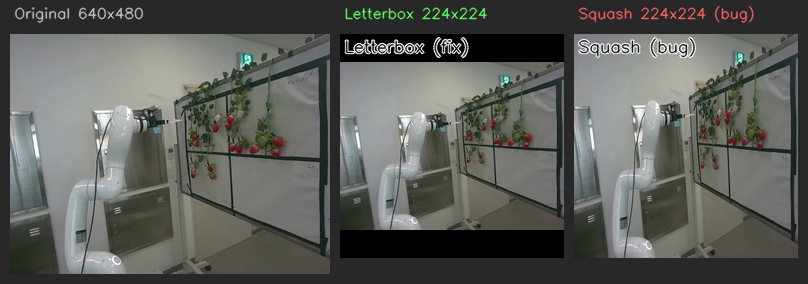

# VLA 데이터 검증 — 일일 이슈 종합 정리

**원본**: `VLA_DAILY_ISSUES.md`  
**정리일**: 2026-06-15  
**대상 기간**: 2026-06-08 ~ 2026-06-13

---

## 1. 개요

이 문서는 VLA(Vision-Language-Action) 모델(pi05)을 딸기 줄기 파지 로봇에 적용하는 과정에서 발견된 14건의 이슈를 날짜별로 추적하고, 각 이슈의 원인·해결 과정·인사이트를 종합 정리한 것이다.

작업 흐름은 세 단계로 구성된다.

```
[A] 수집 → 학습 데이터화
    로봇 센서 ──rosbag(raw)──▶ bag_to_lerobot_eef.py ──▶ mid ──▶ fin

[B] 학습 (pi05)
    fin ──DataLoader──▶ Preprocessor ──▶ 모델 (정규화 공간 학습)

[C] 추론 (서빙)
    로봇 ──client(raw)──▶ server (정규화→모델→역정규화) ──▶ 로봇 (delta)
```

핵심 원리: **모델은 항상 정규화 공간에서만 동작.** 학습·추론이 동일한 stats(q01/q99, min/max)를 사용해야 결과가 일치한다.

> **[이미지 추천 위치 A]**  
> 위 3단계 파이프라인 다이어그램을 시각화한 블록 다이어그램. 수집→변환→학습→추론의 흐름을 화살표로 표현하면 전체 구조 파악에 도움.

---

## 2. 배경 및 목적

- **로봇**: Doosan 협동 로봇 (TCP 기반 제어, 6-DOF + 그리퍼)
- **모델**: pi05 (PaliGemma 기반 flow-matching VLA)
- **태스크**: 딸기 줄기 접근 → 파지 (`"Approach to the strawberry stem."`)
- **데이터셋**: LeRobot v3.0 형식, parquet + MP4, 5Hz
- **학습 환경**: 원격 서버 192.168.50.79, LeRobot 포크, LoRA 파인튜닝
- **서빙 환경**: `serve_pi05.py`, Docker 컨테이너

**목적**: 데이터 수집~학습~추론 전 파이프라인을 검증하고, 모델이 딸기에 올바르게 접근하지 못하는 근본 원인을 규명한다.

---

## 3. 날짜별 이슈 현황 및 해결 과정

---

### 2026-06-08 — 초기 데이터 검증 이슈

#### 발견 #1: 그리퍼 토픽 데이터 오류

**문제 정의**

VLA 명령(action[6] = 0.81~1.0)은 정상이고 로봇도 실제로 동작하는데, 기록된 토픽 데이터(state[12])는 0.001 고정값이었다.

| 항목 | 상태 | 값 |
|------|------|-----|
| 명령 action[6] | 정상 | 0.81~1.0 |
| 실제 동작 | 정상 | Timeline 확인 |
| 토픽 state[12] | 오류 | 0.001 고정 |

**원인**: `/gripper/position` 토픽이 `raw/740²`(≈0.001)로 publish됨. 당시 `get_position()`이 740으로 한 번 더 나눔.

**결과**: 발견 #3에서 근본 원인으로 확정, 발견 #3 해결(v0.4.3) 시 함께 해소.

---

#### 발견 #2: Joint State 토픽 데이터 오류

**문제 정의**

state[6:11](Joint J1~J6)이 전부 고정값(std=0.0)으로 기록됨.

**원인**: `/dsr01/joint_states` 토픽 수집 오류.

**학습 영향**: VLA 모델이 EEF만 입력받으면 영향 없음(확인 후 판단 완료).

---

#### 발견 #3: State vs Action 그리퍼 스케일 버그 (v0.4.3에서 해결)

**문제 정의**

- `state[12]` (그리퍼): 0.001 수준
- `action[6]` (grip_next): 0.81~1.0

동일한 그리퍼인데 state와 action의 범위가 전혀 다름.

**원인 규명 (2026-06-09 확정)**

녹화 시점 `/gripper/position`이 `raw/740²`(≈0.001)로 publish됨. 변환 스크립트(`bag_to_lerobot_eef.py`)는 정상 — 그 값을 그대로 state로 저장하고 `×740`해서 action으로 저장했기 때문에 action만 우연히 정상 ratio(0.811/1.0)였음.

**영향**: state 그리퍼 QUANTILES 정규화 분모 `q99-q01 ≈ 0.00026` → 추론 시 그리퍼값이 수천 배로 폭발.

**해결 (v0.4.3)**
1. `mid/vla_dataset_v0.4.2` → `v0.4.3` 복사
2. 모든 parquet에서 `observation.state[6] *= 740`
   - `0.00109569 → 0.810811`, `0.00135135 → 1.000000`
3. `fin/vla_dataset_v0.4.3` 생성 + stats.json 재계산 → 분모 `0.00026 → 0.189`

---

#### 발견 #4: X축 방향 반대 (추후 원인 특정)

**문제**: 학습 데이터셋은 -X 방향으로 기록, Mock 추론 테스트는 +X 방향으로 예측 → 로봇이 반대 방향으로 움직일 수 있음.

**추후 확인 결과**: 추론 파이프라인 정규화·역정규화 버그(발견 #1~#5)와 이미지 리사이즈 불일치(발견 #5)가 복합 작용한 것으로 추정. 파이프라인 수정 후 재검증 대상.

---

### 2026-06-09 — 추론 파이프라인 정밀 점검 (5건 해결)

> **[이미지 추천 위치 B]**  
> 학습 파이프라인(processor_pi05.py)과 추론 서버(serve_pi05.py)의 처리 단계를 나란히 비교한 표 또는 다이어그램. 어느 단계에서 어떤 버그가 있었는지 색상으로 표시하면 효과적.

#### 발견 #1 (추론): State QUANTILES 정규화 누락 (치명)

**문제 정의**

pi05는 state를 256-bin 이산화하여 텍스트 프롬프트에 넣는다. 학습은 `QUANTILES 정규화 → 이산화` 순서인데, 추론 서버는 정규화 없이 raw 값을 직접 이산화했다.

**영향 (동일 자세에서 bin 비교)**

| 차원 | raw값 | 학습 bin | 서버 bin | 차이 |
|------|------|---------|---------|------|
| x_m | 0.20 | 113 | 153 | 40 |
| z_m | 0.87 | 143 | 239 | 96 |
| rz_rad | -1.5642 | 131 | 0 | 131 |
| gripper | 0.811 | 0 | 231 | 231 |

전 차원이 어긋남 → 모델이 완전히 다른 상태로 인식.

**해결**: `serve_pi05.py`에 stats.json의 state q01/q99로 QUANTILES 정규화 인라인 적용.
```python
norm = 2*(state - q01)/(q99 - q01) - 1
state_np = np.clip(norm, -1, 1)
```

---

#### 발견 #2 (추론): right_wrist 카메라 처리 불일치

**문제**: 학습은 없는 카메라 슬롯을 더미(-1)+mask=0으로 채우는데, 추론 서버는 base 이미지 복제+mask=1(사용)으로 처리함.

**해결**: 서버에서 right_wrist가 없으면 obs에 키를 아예 넣지 않음 → 모델이 학습과 동일하게 더미+mask=0 처리.

---

#### 발견 #4 (추론): 출력 Action 역정규화 누락 (치명)

**문제**: 학습은 ACTION을 MIN_MAX 정규화한 뒤 모델이 `[-1,1]` 값을 출력하도록 학습. 추론 서버는 이 값을 raw로 역정규화하지 않고 그대로 반환.

**영향**: 클라이언트가 정규화값(-1~1)을 raw m로 해석 → 명령 왜곡.

**해결**: `serve_pi05.py`에 inverse MIN_MAX 인라인 적용.
```python
raw = (norm + 1) * (max - min) / 2 + min
```

---

#### 발견 #5 (추론): 이미지 리사이즈 방식 불일치 (치명)

**문제**: 학습은 `resize_with_pad`(비율 유지+레터박스)로 224×224, 추론은 정사각 강제 리사이즈로 224×224.

**메커니즘**

```
[학습]  640×480 → 비율 유지 → 224×168 → 상하 패딩 28px → 224×224 (딸기 정상)
[추론]  640×480 → 강제 압축 → 224×224 (딸기 세로로 1.33배 늘어남)
```

모델 `_preprocess_images`는 입력이 이미 224×224이면 `resize_with_pad`를 스킵하므로, 클라이언트에서 사전 리사이즈하면 왜곡이 그대로 모델에 전달됨.



> 좌: 원본 640×480 / 중: 레터박스 224×224 (수정) / 우: 정사각 강제 리사이즈 224×224 (버그)

**해결**: 클라이언트에서 정사각 리사이즈 제거, 원본 640×480 그대로 전송 → 서버가 `ImageOps.pad`로 레터박스 처리.

---

### 2026-06-10 — 파이프라인 완전 검증 + 텔레오퍼레이션 한계 규명

#### 발견 #6: 추론 파이프라인 학습과 100% 일치 확인

5건 수정 후 학습/추론 파이프라인 전 단계 코드 직접 대조 → 완전 일치 확인. **모델 출력 이상은 순수하게 학습 데이터 품질 문제로 확정.**

---

#### 발견 #7: 버튼 스텝 텔레오퍼레이션의 구조적 한계 (v0.4.3의 근본 문제)

**한 줄 요약**

> 모델은 "이 화면에서 어디로 움직여야 하나"를 배워야 하는데, 학습 데이터는 "같은 화면인데 정답이 여러 개"인 상황을 반복하므로 시각-액션 매핑 자체가 학습 불가.

**문제 1 — 학습 데이터의 75%가 정지 프레임**

버튼 한 번 누를 때마다 20mm 이동 후 정지하는 스텝 방식 → 5Hz 기록 시 대부분이 정지 구간.

| 분류 | 프레임 수 | 비율 |
|------|-----------|------|
| 실제 이동 (|delta| > 5mm) | 66 / 259 | 25% |
| 정지 (near-zero) | 193 / 259 | **75%** |

**문제 2 — 같은 화면인데 정답이 다름**

```
[Frame A] 딸기가 오른쪽에 보임  →  action = 0mm   (버튼 안 누름)
[Frame B] 딸기가 오른쪽에 보임  →  action = 20mm  (버튼 누름)
[Frame C] 딸기가 오른쪽에 보임  →  action = 0mm   (버튼 안 누름)
```

"언제 버튼을 눌렀느냐"는 이미지에서 절대 알 수 없는 정보.

**문제 3 — 정규화 비대칭으로 인한 역정규화 오작동**

ΔX 범위: `-21.85mm ~ +86.52mm` → 정규화 0은 물리 공간의 0이 아니라 **+33mm**가 됨.

```
norm=0.014 (모델 자연 출력) 역정규화 → ≈ +33mm
```

모델이 아무것도 배우지 못해도 역정규화 후 큰 이동 명령이 나오는 이유.

> **[이미지 추천 위치 D]**  
> 버튼 스텝 방식의 action 파형(0과 20mm를 오가는 스파이크 차트) vs 원하는 연속 delta 파형의 비교 그래프. mock test 앱의 액션 타임라인 차트 캡처가 적합.

**해결 방향**: move_spline 웨이포인트 방식으로 전환 → v0.5.0 재수집.

---

#### v0.5.0 전환 (2026-06-10 후속)

move_spline 방식으로 재수집. 목표 TCP 좌표 입력 → 로봇이 스플라인 보간으로 부드럽게 연속 이동 → 매 프레임 작고 연속적인 delta 기록.

| 항목 | v0.4.3 (버튼 스텝) | v0.5.0 (move_spline) |
|------|--------------------|---------------------------|
| action 분포 | 75% 정지 + 25% 20mm 스파이크 | 연속적인 소~중 크기 delta |
| 궤적 형태 | 불연속 계단 | 완만한 연속 곡선 |
| 시각-액션 매핑 | 같은 화면에 정답 0/20mm 혼재 | 화면 상태와 delta 1:1 대응 기대 |

---

### 2026-06-11 — 동기화 아티팩트 발견 + 해결

#### 발견 #8: Nearest-Neighbor 동기화로 인한 Action 파형 왜곡

**한 줄 요약**

> 로봇은 모든 에피소드에서 동일하게 부드럽게 움직였는데, tcp_pose 토픽과 5fps 그리드를 nearest-neighbor로 동기화하는 과정에서 타이밍 지터가 delta 0 / 스파이크로 변환되어 에피소드마다 다른 파형이 만들어진다.

**메커니즘**

tcp_pose 토픽이 잠깐 끊기면 같은 샘플이 연속 그리드에 두 번 선택 → delta=0(가짜 정지) → 다음 프레임에 밀린 변위가 합산(스파이크).

```
정상:  p1      p5      p9  (그리드마다 다른 샘플)
문제:  p2      p2(중복!) p4  →  delta: 0, 12mm (스파이크)
```

**측정 결과 (50 에피소드)**

| 지표 | nearest (기존) | 보간 (변경) |
|------|---------------|------------|
| max step 평균 | 15.7mm | **7.2mm** |
| max step 최악 | 30.7mm | **8.1mm** |
| max step > 8mm 에피소드 | **48 / 50개** | 1 / 50개 |

> **[이미지 추천 위치 E]**  
> ep15, ep49에서 nearest vs 보간의 파형 비교 차트. 두 파형을 같은 x축에 겹쳐 그리면 스파이크 제거 효과가 명확히 보임.

**해결**: `bag_to_lerobot_eef.py`의 `_nearest()` → 선형 보간(`_interp_eef_poses()`)으로 교체. 회전 3채널은 unwrap 후 보간 → 다시 wrap.

---

#### 발견 #8-b: rosbag 버스트 타임스탬프 (부수 발견)

보간 후에도 일부 스파이크가 남아 raw bag을 분석하니 메시지가 버스트로 같은 타임스탬프에 기록되는 현상 발견 (rosbag 기록기가 막혔다 풀리면서 버퍼 7개를 같은 시각에 기록).

**해결**: `_respace_duplicate_ts()` 추가 — 버스트로 뭉친 타임스탬프를 발행 주기 간격으로 되감아 재배치 후 보간.

---

#### 발견 #9: 모델이 목표 지점에서 멈추지 못하는 원인

**원인 1 — 정지가 정규화 공간의 극단**

단방향 동작(dx 항상 ≤0)이라 MIN_MAX 범위의 한쪽 끝이 곧 물리적 0(정지).

| 차원 | 데이터 범위 | 정지(0mm)의 정규화 위치 |
|------|------------|------------------------|
| dx | [-20.6, +0.1] mm | **+0.992** (극단) |
| dy | [-0.0, +14.3] mm | **-0.994** (극단) |
| dz | [-17.7, 0.0] mm | **+0.996** (극단) |

멈추려면 세 차원을 동시에 ±1 극단으로 출력해야 함 → flow matching이 극단값을 정확히 치기 어려움.

**원인 2 — 정지 시범이 데이터의 ~6%뿐**: 에피소드 꼬리 정지 프레임 평균 3.9개 (약 64프레임 중 6%).

**원인 3 — 그리퍼 종료 이벤트 부재**: v0.5.0 수집 시 그리퍼를 한 번도 닫지 않아 파지 이벤트가 없음. 그리퍼 MIN_MAX 분모=0 → 역정규화가 어떤 출력이든 600으로 고정.

**해결 방향**: 재수집 시 파지(그리퍼 닫기) + 정지 구간 1~2초 포함 필수.

---

### 2026-06-12 — 학습 실험 심층 분석

#### 발견 #10: LoRA 적응 범위 병목 + PEFT 모듈명 버그

**증상**: v0.5.2 (보간 데이터, 25에폭 = 6,725스텝) 학습 후에도 추론이 GT를 따라가지 못함.

**진단**

| frame | GT dx (mm) | 모델 dx (mm) | 비고 |
|---|---|---|---|
| 0 | -0.02 (정지) | -0.65 | 출발 전인데 움직임 |
| 30 | -5.14 (GT 피크) | -2.72 | 피크에서 절반 |
| 60 | 0.00 (목표 도착) | -5.08 (모델 최대) | 멈춰야 할 곳에서 최대 출력 |

**부수 발견 — PEFT 모듈명 버그**: 기본값 정규식의 `state_proj`, `action_time_mlp_in/out`은 pi05에 존재하지 않는 이름(pi0용). pi05의 실제 이름은 `time_mlp_in/out`. **지금까지 모든 학습에서 time MLP(denoising 시간 임베딩)가 한 번도 적응되지 않았음.**

**조치**: `train.sh`에 `peft.target_modules` 나열식 지원 + `decay_steps` 자동 폴백 추가.

---

#### 발견 #11: 지름길 학습 — 모델이 이미지를 무시하고 state만 사용

**발견 방법**: 이미지·state를 교차 조합하는 ablation 실험.

**결정적 증거**

| 입력 조합 | 모델 dx 출력 |
|---|---|
| 이미지(초반) + state(초반) | -0.73 mm |
| **이미지(종반)** + state(초반) | -0.67 mm — **이미지 교체 영향 없음** |
| 이미지(초반) + **state(종반)** | -5.34 mm — **state 교체로 7배 변화** |
| 이미지(종반) + state(종반) | -5.46 mm |

출력이 state에만 의존, 이미지 교체 영향 ~2%.

**추가 증거**: 6 에피소드 × 6 프레임 분석에서 모델 출력 크기와 GT의 상관 = -0.13(무관), 시작점 이동거리와 상관 = **+0.97**.

**왜 이렇게 배웠나**: state(절대 위치) 토큰이 저차원·고상관의 쉬운 신호라 모델이 어려운 이미지 입력을 버리고 state 단축경로로 수렴. 발견 #9·#10의 근본 원인.

**추가 검증**: 5에폭 체크포인트에서도 동일 패턴 → 지름길은 학습 극초반부터 형성.

**베이스 모델 비교**: 이미지 영향 비율 베이스 0.34 → 파인튜닝 0.05 — 파인튜닝이 이미지 반응성을 오히려 억제.

**대책**:
1. v0.5.3: LoRA r=32 + 전 모듈 타겟 확장 (vision tower 포함)
2. v0.5.4: State Dropout (p=0.5) — 학습 중 State 토큰을 50% 확률로 제거해 이미지 사용 강제

---

### 2026-06-13 — 서빙 환경 버그 + 대시보드 수정

#### 발견 — v0.5.3 LoRA 모듈 확장이 지름길을 오히려 강화

| 지표 | v0.5.2 | v0.5.3 |
|------|--------|--------|
| GT 추적 상관 (dx) | ≈ 0 | **-0.17 ~ -0.40 (음수, 악화)** |
| ablation 이미지 비율 | ~0.1 | 0.18 미만 |

**해석**: 모델 용량 증가가 state 단축경로로 더 강하게 수렴하게 만든 것으로 추정.

---

#### 발견 #12: Upstream lerobot pip이 서빙 파이프라인을 망가뜨림 (핵심 반전)

**변경**: 서빙 Docker가 pip으로 upstream lerobot을 설치하던 것을 로컬 포크로 교체.

**결과**

| 지표 | 변경 전 (upstream) | 변경 후 (로컬 포크) |
|------|--------------------------|-------------------|
| ablation 이미지 영향 | 0.28mm | **2.36mm** |
| ablation state 영향 | 5.95mm | **0.25mm** |
| 이미지/state 비율 | **0.05** (이미지 무시) | **9.57** (이미지 우세) |

**의미**: 발견 #11에서 "지름길 학습"으로 판단했던 것이 실제로는 **서빙 환경 버그**였을 가능성이 높음. 모델 자체는 이미지를 사용하도록 학습됐으나 upstream lerobot의 변경으로 추론 시 이미지 신호가 유실되고 있었음.

---

#### 수정 — 대시보드 이미지 리사이즈 버그 (발견 #5 재발)

`harvest_dashboard.py`의 `resize_to_224()` 함수가 발견 #5 수정 시 누락되어 정사각 리사이즈 유지. 수정 완료 (약 2643-2652행).

---

#### v0.5.4 — State Dropout 구현

```
p=0.5 확률로: "Task: pick strawberry;\nAction: "  ← State 제거 (이미지만)
p=0.5 확률로: "Task: ..., State: 0 128 255 ...;\nAction: "  ← state 포함
```

수정 파일:
- `configuration_pi05.py`: `state_dropout_prob: float = 0.0` 필드 추가
- `processor_pi05.py`: dropout 로직 추가
- `vla_sft_v.0.5.4.yaml`: `state_dropout_prob: 0.5` 설정

---

#### 발견 #13: 대시보드 instruction 불일치

**원인**: 대시보드 기본값 `"Grasp the strawberry stem and pick it."` vs 학습 데이터 `"Approach to the strawberry stem."`. pi05는 학습 시 본 적 없는 instruction에 신뢰도 낮은 action을 출력 → x/y 출력이 작게 나온 원인.

**해결**: 대시보드 기본값을 학습 instruction과 동일하게 수정.

---

#### 발견 #14: 로봇 이동 버그 — 축별 개별 호출로 X축 외 이동 무시

**원인**: `move_delta`를 축마다 개별적으로 6번 호출 → 두 번째 호출 시점에 `_is_moving=True` 충돌 → `break`로 첫 번째 축만 처리.

**해결**: 모든 축을 한 번의 `move_delta` 호출로 전달.
```python
robot.move_delta(dx=dx, dy=dy, dz=dz, drx=drx, dry=dry, drz=drz)
```

---

## 4. 핵심 관건과 인사이트

### 관건 1 — 학습·추론 파이프라인 불일치 (발견 #1·#2·#3·#4·#5)

5가지 버그(State 정규화 누락, 카메라 슬롯 불일치, 그리퍼 스케일, Action 역정규화 누락, 이미지 리사이즈)가 동시에 존재했다. 이 중 하나만 있어도 모델 출력이 왜곡되는데, 5개가 쌓이면 원인 추적이 매우 어려워진다.

**인사이트**: 학습 전처리 코드(processor_pi05.py)와 서빙 코드(serve_pi05.py)를 **단계별로 코드 레벨에서 직접 대조**하는 것이 핵심. 블랙박스로 결과만 비교하면 원인을 찾기 어렵다.

---

### 관건 2 — 텔레오퍼레이션 방식이 학습 데이터 품질에 직결

버튼 스텝 방식은 아무리 에피소드를 늘려도 시각-액션 매핑을 배울 수 없다. 75% 정지 데이터와 "같은 화면 다른 정답" 문제가 구조적으로 내재되어 있기 때문이다.

**인사이트**: 데이터 수집 방식이 학습 가능성을 근본적으로 결정한다. 에피소드 수보다 수집 방식이 훨씬 중요.

---

### 관건 3 — Nearest-Neighbor 동기화의 숨겨진 아티팩트

move_spline으로 수집 방식을 바꿔도 스파이크가 사라지지 않았다. 원인은 데이터 변환 단계의 동기화 방식이었다. 로봇은 매끄럽게 움직였지만 기록은 왜곡됐다.

**인사이트**: 수집→변환 파이프라인에서 타임스탬프 동기화 방식은 action 파형 품질에 직접 영향을 준다. 시계열 보간이 nearest-neighbor보다 근본적으로 안전하다.

---

### 관건 4 — 지름길 학습 (Shortcut Learning)과 서빙 환경 버그의 혼동

발견 #11에서 "모델이 이미지를 무시한다"고 판단했는데, 발견 #12에서 upstream lerobot pip이 서빙 파이프라인을 망가뜨리고 있었음이 드러났다. 서빙 환경 버그가 제거되자 이미지/state 비율이 0.05 → 9.57로 역전됐다.

**인사이트**: 모델 학습 문제와 서빙 환경 문제는 증상이 동일하게 나타날 수 있다. 모델을 탓하기 전에 추론 환경의 재현성을 먼저 검증해야 한다. **로컬 포크와 upstream 사이의 이탈은 매우 위험하다.**

---

### 관건 5 — 단위·범위 추적의 중요성

같은 그리퍼 값이 `raw`, `ratio`, `정규화값`으로 단계마다 다른 형태로 존재한다. 어느 단계에서 어떤 변환이 일어나는지 추적하지 않으면 스케일 버그가 조용히 학습을 망친다.

| 모달리티 | 로봇/센서 | 학습 데이터(parquet) | 모델 내부 | 추론 출력→로봇 |
|----------|-----------|----------------------|-----------|----------------|
| 위치 | mm | m | 정규화 [-1,1] | (state 전용) |
| 회전 | deg | rad | 정규화 [-1,1] | (state 전용) |
| 그리퍼 | ratio 0~1 | ratio 0.811~1.0 | 정규화 [-1,1] | ratio→×740→0~740 |
| action 위치 | — | Δm | 정규화 [-1,1] | Δm→×1000→mm |
| 이미지 | uint8 0~255 | MP4 uint8 | [-1,1] | — |

---

## 5. 이미지·캡처본 추천 위치 정리

| 위치 | 추천 내용 | 파일/출처 |
|------|----------|----------|
| [A] 개요 섹션 | 3단계 파이프라인 블록 다이어그램 | 직접 제작 (draw.io 등) |
| [B] 발견 #1~5 앞 | 학습 파이프라인 vs 추론 서버 단계 비교 표 | 직접 제작 |
| [C] 발견 #5 | 레터박스 vs 정사각 리사이즈 비교 이미지 | `docs/images/resize_comparison.png` (생성 완료) |
| [D] 발견 #7 | 버튼 스텝 action 파형(스파이크) vs 연속 delta 파형 | mock test 앱 타임라인 차트 캡처 |
| [E] 발견 #8 | ep15/ep49의 nearest vs 보간 파형 비교 | mock test 앱 타임라인 차트 캡처 |
| [F] 발견 #11 | ablation 입력 조합 결과 표 시각화 | mock test 앱 "모델 진단" 탭 캡처 |
| [G] 발견 #12 | 로컬 포크 교체 전후 ablation 비율 변화 막대 그래프 | 직접 제작 |

---

## 6. 전체 이슈 요약 표

| 순번 | 분류 | 문제 | 세부 내용 | 원인 | 해결 | 해결 방안 | 상태 |
|------|------|------|-----------|------|------|-----------|------|
| 1 | 추론 파이프라인 | X축 방향 반대 의심 | 학습 데이터 ⇒ -X 방향 / 추론 예측 ⇒ +X 방향 | 좌표프레임 원인 기각 (수집·추론 둘 다 DR_BASE 일치 확인) | 좌표계 무혐의 | — | 해소 |
| 2 | 학습 데이터 | 그리퍼 토픽 고정값 | state[12] = 0.001 고정 (action[6]은 0.81~1.0 정상) | `/gripper/position`이 raw/740²로 publish됨 (get_position() 이중 나눗셈 버그) | parquet state 재생성 | 모든 parquet `state[6] × 740` 보정 → v0.4.3 재생성 | 해결 |
| 3 | 학습 데이터 | 그리퍼 state·action 스케일 불일치 | state[12] ≈ 0.001 / action[6] = 0.81~1.0 — 같은 그리퍼인데 범위 불일치 | 2번과 동일 근본 원인. 변환 스크립트가 state는 raw 그대로, action만 ×740 적용 | v0.4.3 재생성 | 2번과 동일 (v0.4.3) | 해결 |
| 4 | 학습 데이터 | Joint State 토픽 고정값 | state[6:11] (J1~J6) 전부 std=0.0 고정 | `/dsr01/joint_states` 토픽 수집 오류 | EEF만 사용 (무시) | EEF만 학습에 사용하므로 영향 없음 확인 후 무시 | 해소 |
| 5 | 추론 파이프라인 | State QUANTILES 정규화 누락 | 학습: raw → QUANTILES 정규화 → 256-bin 이산화 / 추론: 정규화 없이 raw 직접 이산화 | 서버가 NormalizerProcessorStep을 건너뜀 | 서버 QUANTILES 인라인 적용 | serve_pi05.py에 `2*(x-q01)/(q99-q01)-1` 인라인 적용 | 해결 |
| 6 | 추론 파이프라인 | 빈 카메라 슬롯 처리 불일치 | 학습: right_wrist 없으면 더미(-1)+mask=0 / 추론: base 이미지 복제+mask=1 | 서버의 `base_img.clone()` fallback | 카메라 키 제외 처리 | 이미지 없으면 obs 딕셔너리에서 키 자체를 제외 → 모델이 학습과 동일하게 더미 처리 | 해결 |
| 7 | 추론 파이프라인 | Action MIN_MAX 역정규화 누락 | 모델 출력 [-1,1]을 raw(m/rad)로 변환 없이 그대로 반환 | 서빙 코드가 postprocessor(UnnormalizerProcessorStep)를 호출하지 않음 | 서버 MIN_MAX 역정규화 인라인 | `(norm+1)/2×(max-min)+min` 인라인 적용. min/max는 normalizer.safetensors에서 로드 | 해결 |
| 8 | 추론 파이프라인 | 이미지 리사이즈 방식 불일치 | 학습: 레터박스(비율 유지+검정 패딩) / 추론: 강제 정사각 리사이즈(세로 1.33배 왜곡) | 서버가 미리 224×224로 리사이즈 → 모델 내부 `resize_with_pad`가 스킵됨 | 서버 레터박스 + 원본 전송 | 서버 `ImageOps.pad` 레터박스 적용 + 클라이언트 정사각 리사이즈 제거(원본 640×480 전송) | 해결 |
| 9 | 추론 파이프라인 | 추론 파이프라인 전수 검증 | 프롬프트·정규화·이산화·이미지·역정규화 전 단계(12스텝) 코드 직접 대조 | (검증 작업) `processor_pi05.py` ↔ `serve_pi05.py` 대조 → 전 단계 100% 일치 확인 | 파이프라인 무혐의 확정 | 파이프라인 무혐의 확정 → 출력 이상은 데이터 문제로 좁혀짐 | 해결 |
| 10 | 학습 데이터 | 버튼 스텝 텔레오퍼레이션 구조적 한계 | 데이터 75%가 정지(near-zero). 같은 화면에 action=0과 action=20mm가 혼재 → 시각-액션 매핑 학습 불가 | 버튼 한 번 = 20mm 점프 후 정지 반복. 정규화 비대칭으로 모델 자연 출력이 역정규화 후 +33mm로 튐 | move_spline 방식 전환 | move_spline 웨이포인트 방식으로 전환 → v0.5.0 재수집 | 해결 |
| 11 | 학습 데이터 | Nearest-Neighbor 동기화 파형 왜곡 | 같은 동작인데 에피소드마다 action 파형 상이. max step 최악 30.7mm, zero-step 최대 21개/에피소드 | tcp_pose 토픽 끊김 시 같은 샘플이 연속 그리드에 중복 선택 → delta=0(가짜 정지) + 스파이크 | 선형 보간으로 교체 | `_nearest()` → 선형 보간(`_interp_eef_poses()`)으로 교체. 회전은 unwrap 후 보간 | 해결 |
| 12 | 학습 데이터 | rosbag 버스트 타임스탬프 | 보간 후에도 일부 에피소드 스파이크 잔존 | rosbag 기록기 버퍼 해제 시 메시지 7개가 동일 타임스탬프로 기록 → 보간 불가 상태 | 버스트 타임스탬프 재배치 | `_respace_duplicate_ts()` 추가 — 버스트 타임스탬프를 발행 주기 간격으로 재배치 후 보간 | 해결 |
| 13 | 학습 데이터 | 모델이 목표 지점에서 멈추지 못함 | 접근은 하지만 목표 도달 후 계속 이동 | ① 단방향 동작이라 정지(0)가 정규화 극단(±0.99) ② 정지 시범 ~6%뿐 ③ 그리퍼 미닫음 → 종료 이벤트 없음 | 파지+정지 포함 재수집 | 재수집 시 파지(그리퍼 닫기) + 정지 구간 1~2초 포함 필수 | 미완 (재수집 필요) |
| 14 | 학습/모델 | LoRA 적응 범위 병목 + PEFT 모듈명 버그 | 25에폭 학습 후에도 GT 위상 추적 실패. time MLP가 학습 내내 미적응 | 기본값 정규식에 pi05 미존재 모듈명(`state_proj`, `action_time_mlp_in/out`) 사용 — pi0용 이름이 혼입 | target_modules 나열식 수정 | `train.sh`에 `peft.target_modules` 나열식 지원 + `decay_steps` 자동 폴백 추가 | 해결 |
| 15 | 학습/모델 | 지름길 학습 (이미지 무시) | ablation: 이미지 교체 영향 ~2%, state 교체 영향 ~7배. 모델이 state 절대 위치만으로 단조 매핑 수렴 | state 토큰이 저차원·고상관의 쉬운 신호 → gradient가 이미지 대신 state로만 흐름. 5에폭 이전 극초반부터 형성 | State Dropout p=0.5 | v0.5.4 State Dropout (p=0.5) 구현 — 학습 중 State 토큰 50% 확률 제거로 이미지 사용 강제 | 진행 중 |
| 16 | 추론 환경 | Upstream lerobot 이미지 임베딩 스케일 제거 | 로컬 포크 교체 전: ablation 비율 0.05 (이미지 무시) / 교체 후: 9.57 (이미지 우세) | upstream 커밋 `01dcb4c2` (2026-05-15)이 `modeling_pi05.py`에서 이미지·언어 임베딩 `× sqrt(hidden_size)` 스케일링 제거 → SigLIP 출력이 액션·state 임베딩 대비 45배 약해져 attention에서 묻힘 | 로컬 포크 editable 설치 | Dockerfile에서 upstream pip 제거, 로컬 포크 editable 설치로 교체. 로컬 포크 유지 필수 | 해결 |
| 17 | 추론 파이프라인 | 대시보드 instruction 불일치 | 대시보드 기본값 ≠ 학습 데이터 instruction → x/y action 출력 작음 | 수정 시 대시보드 기본값 미업데이트 | 대시보드 instruction 동기화 | 대시보드 HTML·Python 기본값을 학습 instruction과 동일하게 수정 | 해결 |
| 18 | 추론 파이프라인 | 대시보드 이미지 리사이즈 버그 재발 | 8번 수정 시 `harvest_dashboard.py`의 `resize_to_224()` 누락 | 수정 범위 미적용 | resize_to_224() 제거 | `harvest_dashboard.py:2643` `resize_to_224()` 제거, 원본 전송으로 수정 | 해결 |
| 19 | 로봇 제어 | 로봇 이동 버그 (축별 개별 호출) | 추론 결과로 X/Y/Z 모두 유효해도 로봇이 첫 번째 축(X)으로만 이동 | `move_delta`를 축마다 6번 개별 호출 → 두 번째 호출 시 `_is_moving=True` 충돌 후 `break` | move_delta 단일 호출 | 모든 축을 `move_delta(dx=dx, dy=dy, dz=dz, ...)` 단일 호출로 전달 | 해결 |
| 20 | 로봇 제어 | VLA 추론 실행 주기 불일치 | 학습 데이터 5Hz(200ms) 수집, 추론 루프 1Hz(1000ms) 실행 → 로봇이 학습 대비 1/5 속도 동작 | 대시보드 `VLA_LOOP_INTERVAL_MS = 1000` 기본값 | LOOP_INTERVAL 200ms | `VLA_LOOP_INTERVAL_MS = 200`으로 수정 (학습 Hz 일치) | 해결 |

| 분류 | 해당 순번 | 의미 |
|------|----------|------|
| 추론 파이프라인 | 1, 5, 6, 7, 8, 9, 17, 18 | 학습↔추론 불일치, 서버 코드 버그 |
| 학습 데이터 | 2, 3, 4, 10, 11, 12, 13 | 수집 방식, 변환 스크립트, 데이터 품질 |
| 학습/모델 | 14, 15 | LoRA 설정, 모델 학습 동역학 |
| 추론 환경 | 16 | 서버 인프라, 패키지 버전 |
| 로봇 제어 | 19, 20 | 명령 전달, 실행 주기 |

---

## 7. 현재 상태 및 다음 단계

**완료된 것**:
- 추론 파이프라인 전 단계 학습-추론 일치 검증
- 데이터 변환 스크립트 선형 보간 교체
- 서빙 환경 로컬 lerobot 포크 고정
- State Dropout (p=0.5) 구현 완료 — v0.5.4 학습 대기 중

**미완 / 진행 중**:
- v0.5.4 학습 완료 후 ablation 검증 (이미지/state 비율 0.3+ 목표)
- 파지 포함 재수집 (발견 #9 해결)
- Occlusion 딸기 파지 시나리오 데이터 수집 (50~100 에피소드)
- 실로봇 추론 검증

**핵심 판단 기준**:
- mock test "입력 의존성 진단"의 이미지/state 비율 **0.3 이상** → 이미지 사용 정상
- "프레임별 GT 추적 진단"의 상관계수 **+0.5 이상** → 위상 추적 성공
- 이 두 지표가 모두 달성되면 실로봇 추론 검증으로 진행
